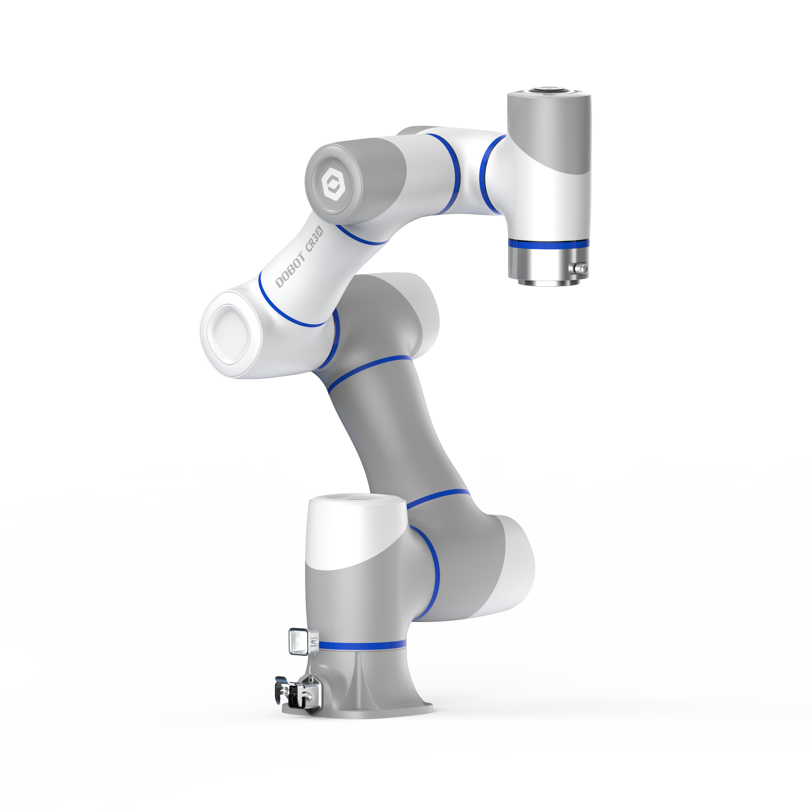

<div align="center">
  


<h1>Dobot TCP/IP Python SDK V4</h1>

**越疆机器人Python SDK V4**  
基于 TCP/IP 协议的高性能机器人控制框架  
支持 CRA、E6、CRAF、NovaLite 等V4系列机器人

[English](README.md) · [简体中文](README.zh.md) · [📖 完整API文档](assets/SDK_API文档_完整版.md)

[](https://github.com/dobot-cn/TCP-IP-Python-V4-main)
[](https://www.python.org/)
[](LICENSE)
[](https://github.com/dobot-cn/TCP-IP-Python-V4-main/issues)

</div>

---

## 快速开始

### 环境要求

| 要求 | 版本 |
|------|------|
| **Python** | 3.8+ |
| **numpy** | ≥1.19.0 |
| **requests** | ≥2.25.0 |

### 安装

**开发模式安装：**

```bash
git clone -b feature/v4-optimization https://github.com/dobot-cn/TCP-IP-Python-V4-main.git
pip install -e .
```

**直接引用（不安装）：**

适用于开发调试阶段或不希望修改Python环境的场景。

```python
import os
import sys
sys.path.insert(0, os.path.dirname(os.path.dirname(os.path.abspath(__file__))))

from dobot_sdk import DobotRobot
```

**目录结构要求**：
```
TCP-IP-Python-V4-main/
├── dobot_sdk/                  ← SDK核心包
├── examples/                   ← 示例目录（脚本放在这里）
│   └── your_script.py
└── README.md
```

**说明**：
- 假设脚本位于 `examples/` 目录下，自动获取项目根目录
- 如果脚本位置不同，调整 `os.path.dirname()` 的调用次数

**更新或重新安装：**

```bash
# 卸载旧版本
pip uninstall dobot_sdk -y

# 重新安装最新版本
pip install -e .

# 验证安装
pip show dobot_sdk
```

### 网络连接

| 配置项 | 说明 |
|--------|------|
| **机器人 IP** | 192.168.1.100（默认） |
| **Dashboard 端口** | 29999 |
| **Feedback 端口** | 30004/30005/30006 |
| **本机 IP** | 需设置为 192.168.X.X 网段 |

---

## 使用示例

### 1. 基础连接

```python
from dobot_sdk import DobotRobot

ROBOT_IP = "192.168.1.100"

# 使用上下文管理器（推荐）
with DobotRobot(ROBOT_IP) as robot:
    # 初始化
    robot.robot_control.RequestControl()
    robot.robot_control.ClearError()
    robot.robot_control.EnableRobot(load=1.0)

    # 执行操作...
    robot.robot_control.SpeedFactor(50)

    # 下使能
    robot.robot_control.DisableRobot()
```

### 2. 运动控制

```python
from dobot_sdk import DobotRobot
from dobot_sdk import CoordinateType

with DobotRobot("192.168.1.100") as robot:
    robot.robot_control.RequestControl()
    robot.robot_control.EnableRobot()

    # 笛卡尔空间运动
    robot.motion.MovJ(
        pose=[400, 0, 300, 180, 0, 0],
        coord_type=CoordinateType.CARTESIAN
    )

    # 直线运动
    robot.motion.MovL(
        pose=[400, 100, 300, 180, 0, 0],
        coord_type=CoordinateType.CARTESIAN
    )
```

### 3. IO控制

```python
from dobot_sdk import DobotRobot

with DobotRobot("192.168.1.100") as robot:
    robot.robot_control.EnableRobot()

    # 数字输出（按手臂二开md文档：DO(index, status)）
    robot.io.DO(1, 1)    # 打开DO1
    robot.io.DO(1, 0)    # 关闭DO1

    # 读取输入
    di_status = robot.io.DI(1)  # 读取DI1
```

---

## 运行示例

```bash
# 运行示例代码
cd examples
python 01_basic_connection.py
python 02_motion_control.py
python 03_error_monitor.py

# 运行图形化界面
cd demo
python main_UI.py
```

---

## 项目结构

```
TCP-IP-Python-V4-main/
├── dobot_sdk/              # SDK 核心包
│   ├── api/                # API 接口层
│   ├── core/               # 核心通信层
│   ├── protocol/           # 协议层
│   └── models/             # 数据模型
├── demo/                   # 演示程序
├── examples/               # 示例代码
├── tests/                  # 测试代码
├── assets/                 # 资源文件
│   ├── CR3A.png            # 机器人图片
│   ├── SDK_API文档_完整版.md    # 完整 API 文档
│   ├── error_controller_README.md  # HTTP 错误接口说明
│   ├── DOBOT TCP_IP二次开发接口文档_V4.6.6_20260410_cn.md  # 官方接口文档 (MD)
│   └── DOBOT TCP_IP二次开发接口文档_V4.6.6_20260410_cn.pdf  # 官方接口文档 (PDF)
├── pyproject.toml          # 项目配置
├── requirements.txt        # 依赖列表
├── README.md               # 英文 README
└── README.zh.md            # 中文 README
```

---

## API 参考

### 主控制类

```python
from dobot_sdk import DobotRobot, CoordinateType
```

| 模块 | 说明 |
|------|------|
| `robot.robot_control` | 基础控制（使能、模式、坐标系、状态查询等） |
| `robot.motion` | 运动控制（MovJ/MovL/Arc/Circle 等） |
| `robot.io` | IO 控制 |
| `robot.communication` | 通信控制 |
| `robot.plugins` | 插件模块（力控、传送带跟踪等） |

### 日志控制

```python
from dobot_sdk import get_logger, set_log_level, get_log_directory

# 设置日志级别：DEBUG, INFO, WARNING, ERROR
set_log_level("DEBUG")

# 获取日志记录器
logger = get_logger()

# 获取日志文件目录
log_dir = get_log_directory()  # 返回: dobot_sdk/logs/
```

| 函数 | 说明 |
|------|------|
| `set_log_level(level)` | 设置日志级别（DEBUG/INFO/WARNING/ERROR） |
| `get_logger()` | 获取 SDK 日志记录器实例 |
| `get_log_directory()` | 获取日志文件存储目录 |

**日志特性：**
- 自动轮转日志文件（最多保留5个文件，每个10MB）
- 跨平台兼容（Windows/Ubuntu）
- 结构化日志格式，包含时间戳和模块信息
- 自动记录 API 调用、命令和响应

### 连接管理

```python
from dobot_sdk import DobotRobot

# 创建机器人对象，设置自定义超时时间
robot = DobotRobot(
    "192.168.1.100",
    connect_timeout=10.0,   # 连接超时时间（秒）
    receive_timeout=15.0    # 接收超时时间（秒）
)

# 启用自动重连，并设置连接状态回调
def on_connection_status(is_connected):
    print(f"连接状态: {'已连接' if is_connected else '已断开'}")

robot.EnableAutoReconnect(enable=True, callback=on_connection_status)

# 检查连接状态
if robot.IsConnected:
    print("机器人已连接")
```

| 函数 | 说明 |
|------|------|
| `robot.SetTimeout(connect_timeout, receive_timeout)` | 设置超时时间 |
| `robot.EnableAutoReconnect(enable, callback)` | 启用/禁用自动重连 |
| `robot.IsConnected` | 检查连接状态（属性） |

**连接特性：**
- **接收超时**：默认10秒，防止接收操作阻塞
- **自动重连**：连接断开时自动尝试重新连接
- **指数退避**：重连延迟按指数增长（1s, 2s, 4s, ..., 最大30s）
- **连接回调**：连接状态变化时收到通知

### 示例代码

更多详细示例请参考：
- `examples/` - 按功能分类的示例代码
- `demo/` - 完整的演示程序

---

## 支持型号

| 系列 | 型号 |
|------|------|
| **CRA 系列** | CR3A, CR5, CR10, CR16 等 |
| **E6 系列** | E6, E6 Pro 等 |
| **CRAF 系列** | CRAF5 等 |
| **NovaLite 系列** | NovaLite 等 |
| **其他 V4 系列** | 支持 TCP/IP 协议的机器人 |

---

## 文档

| 文档 | 说明 |
|------|------|
| [SDK_API文档_完整版.md](assets/SDK_API文档_完整版.md) | 完整 API 文档 |
| [DOBOT TCP_IP二次开发接口文档](assets/DOBOT%20TCP_IP二次开发接口文档_V4.6.6_20260410_cn.pdf) | 官方接口文档 (PDF) |
| [error_controller_README.md](assets/error_controller_README.md) | HTTP 错误接口说明 |

---

## 注意事项

> ⚠️ **安全第一**：运行前确保机器人在安全位置

1. **网络配置**：确保 IP 地址在同一网段
2. **端口占用**：确保 29999 和 30004 端口未被占用
3. **机器人模式**：确保机器人处于 TCP/IP 控制模式
4. **坐标系类型**：所有运动指令必须显式指定 CoordinateType

---

## 版本信息

| 信息 | 内容 |
|------|------|
| **当前版本** | 2.0.0 |
| **Python 要求** | ≥3.8 |
| **主要依赖** | numpy≥1.19.0, requests≥2.25.0 |

---

## 许可证

[MIT License](LICENSE)

<div align="center">

Built by Dobot-Arm

</div>
