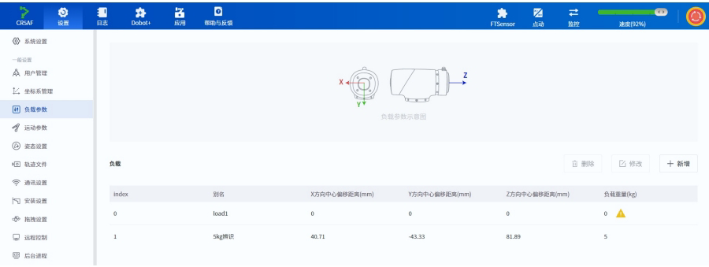

# 手臂二开md文档段落二

## 2.1 控制相关指令

# 指令列表

| **指令**         | **功能**            | **指令类型** |
| -------------- | ----------------- | -------- |
| RequestControl | 请求将设备控制模式切换为TCP模式 | 立即指令     |
| PowerOn        | 机器人上电             | 立即指令     |
| EnableRobot    | 使能机器人             | 立即指令     |
| DisableRobot   | 下使能机器人            | 立即指令     |
| ClearError     | 清除机器人报警           | 立即指令     |
| RunScript      | 运行指定工程            | 立即指令     |
| Stop           | 停止运动 (或正在运行的工程)   | 立即指令     |
| Pause          | 暂停运动 (或正在运行的工程)   | 立即指令     |
| Continue       | 继续运动 (或已暂停的工程)    | 立即指令     |
| EmergencyStop  | 紧急停止机器人           | 立即指令     |
| BrakeControl   | 控制指定关节的抱闸         | 立即指令     |
| StartDrag      | 机器人进入关节拖拽模式       | 立即指令     |
| StopDrag       | 机器人退出拖拽模式         | 立即指令     |

# RequestControl

**原型**

RequestControl()

# 描述

请求将设备控制模式切换为TCP模式。只有在TCP模式下才可执行其他TCP指令。

仅当机器人处于未上电或下使能（且非暂停或松抱闸状态）时才可切换TCP模式。

# 返回

```
ErrorID, {},RequestControl();
```

# 示例

RequestControl()

请求切换TCP模式。

# 允许切换TCP模式的场景

| **控制器状态**          | **是否允许切换TCP模式** |
| ------------------ | --------------- |
| 未上电                | 允许              |
| 下使能(非暂停状态、非抱闸松开状态) | 允许              |
| 使能空闲               | 不允许             |
| 拖拽模式               | 不允许             |
| 单次运动中              | 不允许             |
| 运行中                | 不允许             |
| 暂停                 | 不允许             |
| 错误(上使能情况下)         | 不允许             |
| 松抱闸                | 不允许             |
| 开启手自动模式            | 不允许             |

# PowerOn

# 原型

PowerOn()

# 描述

机器人上电。机器人上电到完成，需要大概10秒钟的时间，然后再进行使能操作。请勿在机器人开机初始化完成前下发控制信号，否则可能会造成机器人异常动作。

# 返回

```
ErrorID, {},PowerOn();
```

# 示例

```
PowerOn()
```

控制机器人上电。

# EnableRobot

# 原型

```
EnableRobot(load,centerX,centerY,centerZ,isCheck)
```

# 描述

使能机器人。

# 可选参数

| **参数名** | **类型** | **说明**                                                                   |
| ------- | ------ | ------------------------------------------------------------------------ |
| load    | double | 设置负载重量, 取值范围不能超过各个型号机器人的负载范围。单位: kg。                                     |
| centerX | double | X方向偏心距离, 单位: mm。                                                         |
| centerY | double | Y方向偏心距离, 单位: mm。                                                         |
| centerZ | double | Z方向偏心距离, 单位: mm。                                                         |
| isCheck | int    | 是否检查负载。1表示检查, 0表示不检查。默认值为0。如果设置为1, 则机器人使能后会检查实际负载是否和设置负载一致, 如果不一致会自动下使能。 |

可携带的参数数量如下：

· 0：不携带参数，表示使能时不设置负载重量和偏心参数。

· 1: 携带一个参数，该参数表示负载重量。

· 4：携带四个参数，分别表示负载重量和偏心参数。

· 5: 携带五个参数，分别表示负载重量、偏心参数和是否检查负载。

# 返回

```
ErrorID, {}, EnableRobot(load, centerX, centerY, centerZ, isCheck);
```

# 示例1

```
EnableRobot()
```

使能机器人，不设置负载重量和偏心参数。

# 示例2

```
EnableRobot(1.5)
```

使能机器人并设置负载重量1.5kg。

# 示例3

```
EnableRobot(1.5,0,0,30.5)
```

使能机器人并设置负载重量1.5kg，Z方向偏心30.5mm，不检查负载。

# 示例4

```
EnableRobot(1.5,0,0,30.5,1)
```

使能机器人并设置负载重量1.5kg，Z方向偏心30.5mm，检查负载。

# DisableRobot

# 原型

```
DisableRobot()
```

# 描述

下使能机器人。

# 返回

```
ErrorID, {}, DisableRobot();
```

# 示例

```
DisableRobot()
```

下使能机器人。

# ClearError

# 原型

```
ClearError()
```

# 描述

清除机器人报警。清除报警后，用户可以根据RobotMode判断机器人是否还处于报警状态。部分报警需要解决报警原因或者重启控制柜后才能清除。

# 返回

```
ErrorID, {},ClearError();
```

# 示例

```
uint64_t robotMode = parseRobotMode(RobotMode()); // parseRobotMode用于获取RobotMode指令返回的值，请自行实现
if(robotMode=9){
    ClearError()
}
```

清除机器人报警。

# RunScript

# 原型

```
RunScript(projectName)
```

# 描述

运行指定工程。如果需要运行工程后立即暂停，则需要在下发RunScript指令后至少间隔1s再下发Pause指令。

# 必选参数

| **参数名**     | **类型** | **说明**                                                                |
| ----------- | ------ | --------------------------------------------------------------------- |
| projectName | string | 工程文件的名称。如果名称包含中文, 必须将发送端的编码方式设置为UTF-8, 否则会导致中文接收异常。如果名称为纯数字, 则需加上双引号。 |

# 返回

```
ErrorID, {}, RunScript(projectName);
```

# 示例1

```
RunScript(demo)
```

运行名称为demo的脚本工程。

# 示例2

RunScript("123")

运行名称为123的脚本工程。

# 示例3

RunScript("blockly\_test")

DobotStudio Pro在保存积木编程工程时会自动添加“blockly\_”前缀。例如在DobotStudio Pro 中保存了一个名为“test”的积木编程工程，则执行该指令时工程名称需要指定 为"blockly\_test"。

# Stop

**原型**

Stop()

# 描述

停止已下发的运动指令队列或者RunScript指令运行的工程。

# 返回

ErrorID,\{},Stop();

# 示例

Stop()

停止点动、脚本运行、关节运动等一系列运动。

# Pause

# 原型

Pause()

# 描述

暂停已下发的运动指令队列或者RunScript指令运行的工程。

# 返回

```
ErrorID, {},Pause();
```

# 示例

```
Pause()
```

暂停movj()等一系列运动，使机器人处于暂停状态，点动不可暂停。

# Continue

# 原型

```
Continue()
```

# 描述

继续已暂停的运动指令队列或者RunScript指令运行的工程。

# 返回

```
ErrorID, {}, Continue();
```

# 示例

```
Continue()
```

继续运动，暂停状态下的算法队列指令可继续运动，机器人处于运行状态。

# EmergencyStop

# 原型

```
EmergencyStop(mode)
```

# 描述

紧急停止机器人。急停后机器人会下使能并报警，需要松开急停、清除报警后才能重新使能。

# 必选参数

| **参数名** | **类型** | **说明**                  |
| ------- | ------ | ----------------------- |
| mode    | int    | 急停操作模式。1表示按下急停,0表示松开急停。 |

# 返回

ErrorID,\{},EmergencyStop(mode);

# 示例

EmergencyStop(1)

紧急停止机器人。

# BrakeControl

# 原型

BrakeControl(axisID,value)

# 描述

控制指定关节的抱闸。机器人静止时关节会自动抱闸，如果用户需进行关节拖拽操作，可开启抱闸，即在机器人下使能状态，手动扶住关节后，下发开启抱闸的指令。

仅能在机器人下使能时控制关节抱闸，否则ErrorID会返回-1。

# 必选参数

| **参数名** | **类型** | **说明**                                    |
| ------- | ------ | ----------------------------------------- |
| axisID  | int    | 关节轴序号, 取值范围: \[1,6]。1表示J1轴, 2表示J2轴, 以此类推。 |
| value   | int    | 设置抱闸状态。0表示抱闸锁死 (关节不可移动)。1表示松开抱闸 (关节可移动)。  |

# 返回

ErrorID,\{},BrakeControl(axisID,value);

# 示例

# BrakeControl(1,1)

松开关节1的抱闸。

# StartDrag

# 原型

StartDrag()

# 描述

机器人进入关节拖拽模式。机器人处于报警状态下时，无法通过该指令进入关节拖拽模式。

# 返回

```
ErrorID, {},StartDrag();
```

# 示例

```
StartDrag()
```

机器人进入关节拖拽模式。

# StopDrag

# 原型

```
StopDrag()
```

# 描述

机器人退出拖拽模式。关节拖拽和力控拖拽均使用此指令退出。

# 返回

```
ErrorID, {}, StopDrag();
```

# 示例

```
StopDrag()
```

机器人退出拖拽模式。

## 2.2 设置相关指令

# 指令列表

| **指令**               | **功能**            | **指令类型** |
| -------------------- | ----------------- | -------- |
| SpeedFactor          | 设置全局速度比例          | 立即指令     |
| User                 | 设置全局用户坐标系         | 队列指令     |
| SetUser              | 修改指定的用户坐标系        | 立即指令     |
| CalcUser             | 计算用户坐标系           | 立即指令     |
| Tool                 | 设置全局工具坐标系         | 队列指令     |
| SetTool              | 修改指定的工具坐标系        | 立即指令     |
| CalcTool             | 计算工具坐标系           | 立即指令     |
| SetPayload           | 设置机械臂末端负载         | 队列指令     |
| AccJ                 | 设置关节运动方式的加速度比例    | 立即指令     |
| AccL                 | 设置直线和弧线运动方式的加速度比例 | 立即指令     |
| VelJ                 | 设置关节运动方式的速度比例     | 立即指令     |
| VelL                 | 设置直线和弧线运动方式的速度比例  | 立即指令     |
| CP                   | 设置平滑过渡比例          | 立即指令     |
| SetCollisionLevel    | 设置碰撞检测等级          | 队列指令     |
| SetBackDistance      | 设置碰撞回退距离          | 队列指令     |
| SetPostCollisionMode | 设置碰撞后处理方式         | 队列指令     |
| DragSensitivity      | 设置拖拽灵敏度           | 立即指令     |
| EnableSafeSkin       | 开启或关闭安全皮肤功能       | 队列指令     |
| SetSafeSkin          | 设置安全皮肤各个部位的灵敏度    | 队列指令     |
| SetSafeWallEnable    | 开启或关闭指定的安全墙       | 队列指令     |
| SetWorkZoneEnable    | 开启或关闭指定的安全区域      | 队列指令     |

# i说明:

如无特殊说明，TCP指令设置的参数均只在本次TCP/IP控制模式中生效。

# SpeedFactor

# 原型

SpeedFactor(ratio)

# 描述

设置全局速度比例。

● 机器人点动时实际运动加速度/速度比例 = 控制软件点动设置中的值 x 全局速度比例。

例：控制软件设置的关节速度为12°/s，全局速率为50%，则实际点动速度为12°/s x 50% = 6°/s

● 机器人再现时实际运动加速度/速度比例 = 运动指令可选参数设置的比例 x 控制软件再现设置中的值 x 全局速度比例。

例：控制软件设置的坐标系速度为2000mm/s，全局速率为50%，运动指令设置的速率为80%，则实际运动速度为2000mm/s x 50% x 80% = 800mm/s

未设置时沿用进入TCP/IP控制模式前控制软件设置的值。

# 必选参数

| **参数名** | **类型** | **说明**                     |
| ------- | ------ | -------------------------- |
| ratio   | int    | 全局运动速度比例, 取值范围: \[1, 100]。 |

# 返回

ErrorID,\{},SpeedFactor(ratio);

# 示例

SpeedFactor(80)

设置全局运动速度比例为80%。

# User

# 原型

User(index)

# 描述

设置全局用户坐标系。用户下发运动指令时可选择用户坐标系，如未指定，则会使用全局用户坐标系。

未设置时默认的全局用户坐标系为用户坐标系0。

# 必选参数

| **参数名** | **类型** | **说明**                                                 |
| ------- | ------ | ------------------------------------------------------ |
| index   | int    | 选择已标定的用户坐标系索引。需要通过控制软件等方式标定后才可在此处通过索引选择。取值范围: \[0,50]。 |

# 返回

```
ErrorID, {ResultID}, User(index);
```

若ErrorID返回-1，表示设置失败。ResultID为算法队列ID，可用于判断指令执行顺序。

# 示例

```
User(1)
```

设置用户坐标系1为全局用户坐标系。

# SetUser

# 原型：

```
SetUser(index, value, type)
```

# 描述:

修改指定的用户坐标系。

# 必选参数：

| **参数名** | **类型** | **说明**                                                 |
| ------- | ------ | ------------------------------------------------------ |
| index   | int    | 选择已标定的用户坐标系索引。需要通过控制软件等方式标定后才可在此处通过索引选择。取值范围: \[1,50]。 |
| value   | string | 修改后的用户坐标系, 格式为\{x, y, z, rx, ry, rz}。建议使用CalcUser指令获取。 |

# 可选参数：

| **参数名** | **类型** | **说明**                                                                                         |
| ------- | ------ | ---------------------------------------------------------------------------------------------- |
| type    | int    | 是否使坐标系改动全局生效。0: 该命令修改的坐标系仅在当前工程运行中生效, 退出TCP模式后恢复为原来的值。1: 该命令修改的坐标系将会被控制器保存, 退出TCP模式后依然保持修改后的值。 |

# 返回：

```
ErrorID, {}, SetUser(index, table, type);
```

# 示例：

```
SetUser(1,{10,10,10,0,0,0})
```

修改用户坐标系1为$x=10, y=10, z=10, rx=0, ry=0, rz=0$。

# CalcUser

# 原型：

```
CalcUser(index,matrix,offset)
```

# 描述:

计算用户坐标系。

# 必选参数：

| **参数名** | **类型** | **说明**                                                                         |
| ------- | ------ | ------------------------------------------------------------------------------ |
| index   | int    | 选择已标定的用户坐标系索引。需要通过控制软件等方式标定后才可在此处通过索引选择。取值范围: \[0,50]。                         |
| matrix  | int    | 计算的方向。1表示左乘, 即index指定的坐标系沿基坐标系偏转offset指定的值。0表示右乘, 即index指定的坐标系沿自己偏转offset指定的值。 |
| offset  | string | 格式为\{x, y, z, rx, ry, rz}, 表示用户坐标系的偏移值。                                        |

# 返回：

```
ErrorID, {x,y,z,rx,ry,rz},CalcUser(index,matrix,offset);
```

其中\{x, y, z, rx, ry, rz}为计算得出的用户坐标系。

示例1：

```
newUser = CalcUser(1,1,{10,10,10,10,10,10})
```

计算用户坐标系1左乘\{10,10,10,0,0,0}后的值。计算过程可等价为：一个初始位姿与用户坐标系1相同的坐标系，沿基坐标系平移\{x=10, y=10, z=10}并旋转\{rx=10, ry=10, rz=10}后，得到的新坐标系为newUser。

# 示例2：

```
newUser = CalcUser(1,0,{10,10,10,10,10,10})
```

计算用户坐标系1右乘\{10,10,10,0,0,0}后的值。计算过程可等价为：一个初始位姿与用户坐标系1相同的坐标系，沿用户坐标系1平移\{x=10, y=10, z=10}并旋转\{rx=10, ry=10, rz=10}后，得到的新坐标系为newUser。

# Tool

# 原型

```
Tool(index)
```

# 描述

设置全局工具坐标系。用户下发运动指令时可选择工具坐标系，如未指定，则会使用全局工具坐标系。

未设置时默认的全局工具坐标系为工具坐标系0。

# 必选参数

| **参数名** | **类型** | **说明**                                                 |
| ------- | ------ | ------------------------------------------------------ |
| index   | int    | 选择已标定的工具坐标系索引。需要通过控制软件等方式标定后才可在此处通过索引选择。取值范围: \[0,50]。 |

# 返回

```
ErrorID,{ResultID},Tool(index);
```

若ErrorID返回-1，表示设置的工具坐标索引索引不存在；ResultID为算法队列ID，可用于判断指令执行顺序。

# 示例

Tool(1)

设置工具坐标系1为全局工具坐标系。

# SetTool

# 原型：

SetTool(index,value,type)

# 描述:

修改指定的工具坐标系。

# 必选参数:

| **参数名** | **类型** | **说明**                                                    |
| ------- | ------ | --------------------------------------------------------- |
| index   | int    | 选择已标定的工具坐标系索引。需要通过控制软件等方式标定后才可在此处通过索引选择。取值范围: \[1,50]。    |
| value   | string | 修改后的工具坐标系, 格式为\{x, y, z, rx, ry, rz}。表示该坐标系相对默认工具坐标系的偏移量。 |

# 可选参数:

| **参数名** | **类型** | **说明**                                                                                         |
| ------- | ------ | ---------------------------------------------------------------------------------------------- |
| type    | int    | 是否使坐标系改动全局生效。0: 该命令修改的坐标系仅在当前工程运行中生效, 退出TCP模式后恢复为原来的值。1: 该命令修改的坐标系将会被控制器保存, 退出TCP模式后依然保持修改后的值。 |

# 返回：

ErrorID,\{},SetTool(index,table,type);

# 示例：

SetTool(1,\{10,10,10,0,0,0})

修改工具坐标系1为$x=10, y=10, z=10, rx=0, ry=0, rz=0$。

# CalcTool

原型：

CalcTool(index,matrix,offset)

# 描述:

计算工具坐标系。

# 必选参数:

| **参数名** | **类型** | **说明**                                                                              |
| ------- | ------ | ----------------------------------------------------------------------------------- |
| index   | int    | 选择已标定的工具坐标系索引。需要通过控制软件等方式标定后才可在此处通过索引选择。取值范围: \[0,50]。                              |
| matrix  | int    | 计算的方向。1表示左乘, 即index指定的工具坐标系沿法兰坐标系偏转offset指定的值。0表示右乘, 即index指定的工具坐标系沿自己偏转offset指定的值。 |
| offset  | string | 格式为\{x, y, z, rx, ry, rz}, 表示工具坐标系的偏移值。                                             |

返回：

ErrorID,\{x,y,z,rx,ry,rz},CalcTool(index,matrix,offset);

其中\{x, y, z, rx, ry, rz}为计算得出的工具坐标系。

# 示例1：

​$\text{CalcTool}(1,1,\{ 10,10,10,0,0,0\})$​

计算工具坐标系1左乘\{10,10,10,0,0,0}后的值。计算过程可等价为:一个初始位姿与工具坐标系1相同的坐标系,沿法兰坐标系平移\{x=10, y=10, z=10}并旋转\{rx=10, ry=10, rz=10}后,得到的新坐标系为newTool。

# 示例2:

​$\text{CalcTool}(1,\theta,\{ 1\theta,1\theta,1\theta,\theta,\theta,\theta\})$​

计算工具坐标系1右乘\{10,10,10,0,0}后的值。计算过程可等价为:一个初始位姿与工具坐标系1相同的坐标系,沿工具坐标系1平移\{x=10, y=10, z=10}并旋转\{rx=10, ry=10, rz=10}后,得到的新坐标系为newTool。

# SetPayload

# 原型

SetPayload(load,x,y,z)

SetPayload(name)

# 描述

设置机器人末端负载，支持两种设置方式。

# 方式一：直接设置负载参数

# 必选参数1

| **参数名** | **类型** | **说明**                               |
| ------- | ------ | ------------------------------------ |
| load    | double | 设置负载重量, 单位: kg。取值范围不能超过各个型号机器人的负载范围。 |

# 可选参数1

| **参数名** | **类型** | **说明**              |
| ------- | ------ | ------------------- |
| x       | double | 末端负载X轴偏心坐标, 单位: mm。 |
| y       | double | 末端负载Y轴偏心坐标, 单位: mm。 |
| z       | double | 末端负载Z轴偏心坐标, 单位: mm。 |

需同时设置或不设置这三个参数。偏心坐标为负载(含治具)的质心在默认工具坐标系下的坐标，参考下图。

Z\<→\n

# 方式二：通过控制软件保存的预设负载参数组设置

# 必选参数2

| **参数名** | **类型** | **说明**             |
| ------- | ------ | ------------------ |
| name    | string | 控制软件保存的预设负载参数组的名称。 |

20CRSAF设置日末Dobot应用帮助与反馆FTScnsor点动监控速度(92%系统浪置一般设置用户管理坐标系管理负载参数负载参数示意图运动参数姿态设置负载删除修改十新增回轨迹文件通讯设置index别名Y方向中心偏移距离(mm)X方向中心编移距离(mmZ方向中心偏移距离(mm)负载重量(kg)安装设置00000load1拖搜设置15kg辨识40.71-43.3381.89远程控制后台通程\n



​

# 返回

ErrorID,\{\ResultID},SetPayload(load,x,y,z);

ErrorID,\{\ResultID},SetPayload(name);

ResultID为算法队列ID，可用于判断指令执行顺序。

# 示例1

SetPayload(3,10,10,10)

设置末端负载重量为3kg，偏心坐标为\{10,10,10}。

# 示例2

SetPayload("Load1")

加载名称为“Load1”的预设负载参数组。

# AccJ

# 原型

AccJ(R)

# 描述

设置关节运动方式的加速度比例。

未设置时默认值为100。

# 必选参数

| **参数名** | **类型** | **说明**                 |
| ------- | ------ | ---------------------- |
| R       | int    | 关节加速度比例。取值范围: \[1,100] |

# 返回

```
ErrorID, {},AccJ(R);
```

# 示例

```
AccJ(50)
```

设置关节运动方式的加速度比例为50%。

# AccL

# 原型

AcCL(R)

# 描述

设置直线和弧线运动方式的加速度比例。

未设置时默认值为100。

# 必选参数

| **参数名** | **类型** | **说明**               |
| ------- | ------ | -------------------- |
| R       | int    | 加速度比例。取值范围: \[1,100] |

# 返回

```
ErrorID, {},AccL(R);
```

# 示例

AccL (50)

设置直线和弧线运动方式的加速度比例为50%。

# VelJ

# 原型

VelJ(R)

# 描述

设置关节运动方式的速度比例。

未设置时默认值为100。

# 必选参数

| **参数名** | **类型** | **说明**              |
| ------- | ------ | ------------------- |
| R       | int    | 速度比例。取值范围: \[1,100] |

# 返回

```
ErrorID, {},VelJ(R);
```

# 示例

```
VelJ(50)
```

设置关节运动方式的速度比例为50%。

# VelL

# 原型

VelL(R)

# 描述

设置直线和弧线运动方式的速度比例。

未设置时默认值为100。

# 必选参数

| **参数名** | **类型** | **说明**              |
| ------- | ------ | ------------------- |
| R       | int    | 速度比例。取值范围: \[1,100] |

# 返回

ErrorID,\{},VelL(R);

# 示例

VeLL(50)

设置直线和弧线运动方式的速度比例为50%。

# CP

# 原型

CP(R)

# 描述

设置平滑过渡比例，即机器人连续运动经过多个点时，经过中间点是以直角方式过渡还是以曲线方式过渡。

未设置时默认值为0。

CP=0P2CP=50%CP=100%P1P3\n

# 必选参数

| **参数名** | **类型** | **说明**                 |
| ------- | ------ | ---------------------- |
| R       | int    | 平滑过渡比例。取值范围: \[0, 100] |

# 返回

ErrorID, \{},CP(R);

# 示例

CP(50)

设置平滑过渡比例为50%。

# SetCollisionLevel

# 原型

SetCollisionLevel(level)

# 描述

设置碰撞检测等级。

未设置时沿用进入TCP/IP控制模式前控制软件设置的值。

# 必选参数

| **参数名** | **类型** | **说明**                                           |
| ------- | ------ | ------------------------------------------------ |
| level   | int    | 碰撞检测等级，取值范围：$[0,5]$。0表示关闭碰撞检测，$1\sim5$数字越大灵敏度越高。 |

# 返回

```
ErrorID,{ResultID},SetCollisionLevel(level);
```

ResultID为算法队列ID，可用于判断指令执行顺序。

# 示例

```
SetCollisionLevel(1)
```

设置碰撞检测等级为1。

# SetBackDistance

# 原型：

```
SetBackDistance(distance)
```

# 描述:

设置机器人检测到碰撞后原路回退的距离。

未设置时沿用进入TCP/IP控制模式前控制软件设置的值。

# 必选参数：

| **参数名**  | **类型** | **说明**                          |
| -------- | ------ | ------------------------------- |
| distance | double | 碰撞回退的距离, 取值范围: \[0,50], 单位: mm。 |

# 返回

```
ErrorID, {ResultID}, SetBackDistance(distance)
```

ResultID为算法队列ID，可用于判断指令执行顺序。

# 示例：

```
SetBackDistance(20)
```

设置碰撞回退距离为20mm。

# SetPostCollisionMode

# 原型：

```
SetPostCollisionMode(mode)
```

# 描述:

设置机器人检测到碰撞后进入的状态。

未设置时沿用进入TCP/IP控制模式前控制软件设置的值。

# 必选参数：

| **参数名** | **类型** | **说明**                                    |
| ------- | ------ | ----------------------------------------- |
| mode    | int    | 碰撞后处理方式。0表示检测到碰撞后进入停止状态, 1表示检测到碰撞后进入暂停状态。 |

# 返回

```
ErrorID,{ResultID},SetPostCollisionMode(mode)
```

ResultID为算法队列ID，可用于判断指令执行顺序。

# 示例：

```
SetPostCollisionMode(0)
```

设置机器人检测到碰撞后进入停止状态。

# DragSensitivity

# 原型

DragSensitivity(index,value)

# 描述

设置拖拽灵敏度。

未设置时沿用进入TCP/IP控制模式前控制软件设置的值。

# 必选参数

| **参数名** | **类型** | **说明**                                                   |
| ------- | ------ | -------------------------------------------------------- |
| index   | int    | 轴序号, 取值范围: \[0,6]。0表示所有轴设置为相同的灵敏度。1\~6分别表示设置J1\~J6轴的灵敏度。 |
| value   | int    | 拖拽灵敏度, 值越小, 拖拽时的阻力越大。取值范围: \[1, 90]。                     |

# 返回

ErrorID, \{},DragSensitivity(index,value);

# 示例

DragSensitivity(0,50)

设置所有轴的拖拽灵敏度为50。

# EnableSafeSkin

# 原型

EnableSafeSkin(status)

# 描述

开启或关闭安全皮肤功能。仅对安装了安全皮肤的机器人有效。

# 必选参数

| **参数名** | **类型** | **说明**                  |
| ------- | ------ | ----------------------- |
| status  | int    | 电子皮肤功能开关, 0表示关闭, 1表示开启。 |

# 返回

```
ErrorID, {ResultID}, EnableSafeSkin(status);
```

ResultID为算法队列ID，可用于判断指令执行顺序。若返回ErrorID为-1，可能是当前无电子皮肤。

# 示例

```
EnableSafeSkin(1)
```

开启电子皮肤功能。

# SetSafeSkin

# 原型

```
SetSafeSkin(part,status)
```

# 描述

设置安全皮肤各个部位的灵敏度。仅对安装了安全皮肤的机器人有效。

未设置时沿用进入TCP/IP控制模式前控制软件设置的值。

# 必选参数

| **参数名** | **类型** | **说明**                                     |
| ------- | ------ | ------------------------------------------ |
| part    | int    | 要设置的部位, 3表示arm (小臂安全皮肤), 4\~6分别表示J4\~J6关节。 |
| status  | int    | 灵敏度, 0表示关闭, 1表示low, 2表示middle, 3表示high。    |

# 返回

```
ErrorID,{ResultID},SetSafeSkin(part,status);
```

ResultID为算法队列ID，可用于判断指令执行顺序。

# 示例

SetSafeSkin(3,1)

设置小臂的电子皮肤为低灵敏度。

# SetSafeWallEnable

# 原型：

```
SetSafeWallEnable(index, value)
```

# 描述:

开启或关闭指定的安全墙。

# 必选参数：

| **参数名** | **类型** | **说明**                                     |
| ------- | ------ | ------------------------------------------ |
| index   | int    | 要设置的安全墙索引, 需要先在控制软件中添加对应的安全墙。取值范围: \[1,8]。 |
| value   | int    | 安全墙开关, 0表示关闭, 1表示开启。                       |

# 返回

```
ErrorID, {ResultID}, SetSafeWallEnable(index, value);
```

ResultID为算法队列ID，可用于判断指令执行顺序。

# 示例：

```
SetSafeWallEnable(1,1)
```

开启索引为1的安全墙。

# SetWorkZoneEnable

# 原型：

```
SetWorkZoneEnable(index, value)
```

# 描述:

开启或关闭指定的安全区域。

# 必选参数：

| **参数名** | **类型** | **说明**                                       |
| ------- | ------ | -------------------------------------------- |
| index   | int    | 要设置的安全区域索引, 需要先在控制软件中添加对应的安全区域。取值范围: \[1,6]。 |
| value   | int    | 安全区域开关, 0表示关闭, 1表示开启。                        |

# 返回

```
ErrorID, {ResultID}, SetWorkZoneEnable(index, value);
```

ResultID为算法队列ID，可用于判断指令执行顺序。

# 示例：

```
SetWorkZoneEnable(1,1)
```

开启索引为1的安全区域。

## 2.3 计算和获取相关指令

# 指令列表

| **指令**       | **功能**                  | **指令类型** |
| ------------ | ----------------------- | -------- |
| RobotMode    | 获取机器人当前状态               | 立即指令     |
| PositiveKin  | 进行正解运算                  | 立即指令     |
| InverseKin   | 进行逆解运算                  | 立即指令     |
| GetAngle     | 获取机器人当前位姿的关节坐标          | 立即指令     |
| GetPose      | 获取机器人当前位姿在指定的坐标系下的笛卡尔坐标 | 立即指令     |
| GetErrorID   | 获取机器人当前报错的错误码           | 立即指令     |
| CreateTray   | 创建托盘                    | 立即指令     |
| GetTrayPoint | 获取托盘点                   | 立即指令     |
| GetScrName   | 获取当前机器人正在运行的脚本名称        | 立即指令     |

# RobotMode

# 原型

RobotMode()

# 描述

获取机器人当前状态。

# 返回

```
ErrorID,{Value},RobotMode();
```

Value取值范围如下：

| **取值** | **定义**                   | **说明**     |
| ------ | ------------------------ | ---------- |
| 1      | ROBOT\_MODE\_INIT        | 初始化状态      |
| 2      | ROBOT\_MODE\_BRAKE\_OPEN | 有任意关节的抱闸松开 |
| 3      | ROBOT\_MODE\_POWEROFF    | 机械臂下电状态    |

| **取值** | **定义**                    | **说明**                                 |
| ------ | ------------------------- | -------------------------------------- |
| 4      | ROBOT\_MODE\_DISABLED     | 未使能 (无抱闸松开)                            |
| 5      | ROBOT\_MODE\_ENABLE       | 使能且空闲                                  |
| 6      | ROBOT\_MODE\_BACKDRIVE    | 拖拽模式 (关节拖拽或力控拖拽)                       |
| 7      | ROBOT\_MODE\_RUNNING      | 运行状态(工程, TCP队列运动等)                     |
| 8      | ROBOT\_MODE\_SINGLE\_MOVE | 单次运动状态 (点动、RunTo等)                     |
| 9      | ROBOT\_MODE\_ERROR        | 有未清除的报警。此状态优先级最高。无论机械臂处于什么状态, 有报警时都返回9 |
| 10     | ROBOT\_MODE\_PAUSE        | 暂停状态                                   |
| 11     | ROBOT\_MODE\_COLLISION    | 碰撞检测触发状态                               |

# 示例

RobotMode()

获取机器人当前状态。

# PositiveKin

# 原型

PositiveKin(J1,J2,J3,J4,J5,J6,user,tool)

# 描述

进行正解运算：给定机器人各关节角度，计算机器人末端在给定的笛卡尔坐标系中的坐标值。

# 必选参数

| **参数名** | **类型** | **说明**        |
| ------- | ------ | ------------- |
| J1      | double | J1轴位置, 单位: 度。 |
| J2      | double | J2轴位置, 单位: 度。 |
| J3      | double | J3轴位置, 单位: 度。 |
| J4      | double | J4轴位置, 单位: 度。 |
| J5      | double | J5轴位置, 单位: 度。 |
| J6      | double | J6轴位置, 单位: 度。 |

# 可选参数

| **参数名** | **类型** | **说明**                                                          |
| ------- | ------ | --------------------------------------------------------------- |
| user    | string | 格式为"user=index", index为已标定的用户坐标系索引。不指定时使用全局用户坐标系。取值范围: \[0,50]。 |
| tool    | string | 格式为"tool=index", index为已标定的工具坐标系索引。不指定时使用全局工具坐标系。取值范围: \[0,50]。 |

# 返回

```
ErrorID, {x,y,z,a,b,c}, PositiveKin(J1,J2,J3,J4,J5,J6,user,tool);
```

\{x,y,z,a,b,c}为点位的笛卡尔坐标值。

# 示例

```
PositiveKin(0,0,-90,0,90,0,user=1,tool=1)
```

关节坐标为\{0,0,-90,0,90,0}, 计算机器人末端在用户坐标系1和工具坐标系1下的笛卡尔坐标。

# InverseKin

# 原型

```
InverseKin(X,Y,Z,Rx,Ry,Rz,useJointNear,jointNear,user,tool)
```

# 描述

进行逆解运算：给定机器人末端在给定的笛卡尔坐标系中的坐标值，计算机器人各关节角度。

由于笛卡尔坐标仅定义了TCP的空间坐标与倾斜角，所以机器人可以通过多种不同的姿态到达同一个位姿，意味着一个位姿变量可以对应多个关节变量。为得出唯一的解，系统需要一个指定的关节坐标，选择最接近该关节坐标的解作为逆解结果。

# 必选参数

| **参数名** | **类型** | **说明**        |
| ------- | ------ | ------------- |
| X       | double | X轴位置, 单位: mm。 |
| Y       | double | Y轴位置, 单位: mm。 |
| Z       | double | Z轴位置, 单位: mm。 |
| Rx      | double | Rx轴位置, 单位: 度。 |
| Ry      | double | Ry轴位置, 单位: 度。 |

| **Rz** | **double** | **Rz轴位置, 单位: 度。** |
| ------ | ---------- | ----------------- |

# 可选参数

| **参数名**      | **类型** | **说明**                                                                                                                                                              |
| ------------ | ------ | ------------------------------------------------------------------------------------------------------------------------------------------------------------------- |
| useJointNear | string | 格式为 "useJointNear=value", 用于设置JointNear参数是否有效。"useJointNear=0"或不携带表示JointNear参数无效, 系统根据机械臂当前关节角度就近选解。"useJointNear=1"表示根据JointNear就近选解。仅携带该参数而不携带JointNear时, 该参数无效。 |
| jointNear    | string | 格式为 "jointNear=\{j1,j2,j3,j4,j5,j6}", 用于就近选解的关节坐标。                                                                                                                  |
| user         | string | 格式为 "user=index", index为已标定的用户坐标系索引。不指定时使用全局用户坐标系。取值范围: \[0,50]。                                                                                                    |
| tool         | string | 格式为 "tool=index", index为已标定的工具坐标系索引。不指定时使用全局工具坐标系。取值范围: \[0,50]。                                                                                                    |

# 返回

```
ErrorID, {J1, J2, J3, J4, J5, J6}, InverseKin(X, Y, Z, Rx, Ry, Rz, useJointNear, jointNear, user, tool);
```

\{J1,J2,J3,J4,J5,J6}为点位的关节坐标值。

# 示例

```
InverseKin(473.000000, -141.000000, 469.000000, -180.000000, 0.000, -90.000)
```

机器人末端在全局用户坐标系和全局关节坐标系下的笛卡尔坐标为\{473,-141,469,-180,0,-90}，计算关节坐标，选择机器人当前关节角度的最近解。

# GetAngle

# 原型

```
GetAngle()
```

# 描述

获取机器人当前位姿的关节坐标。

# 返回

```
ErrorID, {J1, J2, J3, J4, J5, J6}, GetAngle();
```

\{J1, J2, J3, J4, J5, J6}表示机器人当前位姿的关节坐标。

# 示例

GetAngle()

获取机器人当前位姿的关节坐标。

# GetPose

# 原型

```
GetPose(user, tool)
```

# 描述

获取机器人当前位姿在指定的坐标系下的笛卡尔坐标。

# 可选参数

| **参数名** | **类型** | **说明**                                            |
| ------- | ------ | ------------------------------------------------- |
| user    | string | 格式为"user=index", index为已标定的用户坐标系索引。取值范围: \[0,50]。 |
| tool    | string | 格式为"tool=index", index为已标定的工具坐标系索引。取值范围: \[0,50]。 |

必须同时传或同时不传，不传时默认为全局用户和工具坐标系。

# 返回

```
ErrorID, {X, Y, Z, Rx, Ry, Rz}, GetPose(user, tool);
```

\{X,Y,Z,Rx,Ry,Rz}表示机器人当前位姿的笛卡尔坐标。

# 示例

```
GetPose(user=1,tool=1)
```

获取机器人当前位姿在用户坐标系1和工具坐标系1下的笛卡尔坐标。

# GetErrorID

# 原型

GetErrorID()

# 描述

获取机器人当前报错的错误码。

# 返回

​$\text{ErrorID},\{[id,\dots,id]\},\text{GetErrorID();}$​

● ErrorID 为0时表示命令接收成功，返回非0则代表命令有错误，详见通用错误码；

● \[id,...,id]为控制器以及算法报警信息，无报警时返回\[],有多个报警时以英文逗号”，”相隔。

# 示例

GetErrorID()

获取机器人当前报错的错误码。

# CreateTray

# 原型：

```
CreateTray(Trayname, {Count}, {P1},{P2}) -- 一维托盘
CreateTray(Trayname, {row,col}, {P1},{P2},{P3},{P4}) -- 二维托盘
CreateTray(Trayname, {row,col,layer}, {P1},{P2},{P3},{P4},{P5},{P6},{P7},{P8}) -- 三维托盘
```

# 描述:

创建托盘，支持创建一维、二维和三维的托盘。最多可创建20个托盘，创建同名的托盘时会覆盖已有的托盘，不会增加托盘数量。

# 必选参数:

| **参数名**  | **类型** | **说明**                          |
| -------- | ------ | ------------------------------- |
| Trayname | string | 托盘名称, 最长32字节的字符串, 不允许为纯数字或者纯空格。 |

维度参数为table变量，各点位为独立的table参数，每个点位格式为 {pose = {x,y,z,rx,ry,rz}}。下文分别进行介绍。

● 创建一维托盘：一维托盘是在一条直线上等距分布的一组点。

| **参数名**   | **类型** | **说明**                                              |
| --------- | ------ | --------------------------------------------------- |
| \{Count}  | table  | Count表示点位数量,取值范围:\[2,50],输入非整数会自动向下取整。              |
| \{P1}     | table  | P1为一维托盘的第1个端点, 格式为 {pose = \{x,y,z,rx,ry,rz}}。      |
| \{P2}     | table  | P2为一维托盘的第2个端点, 格式为 {pose = \{x,y,z,rx,ry,rz}}。      |

P1P2Count\n

● 创建二维托盘：二维托盘是在一个平面上阵列分布的一组点。

| **参数名**    | **类型** | **说明**                                                                     |
| ----------- | ------ | -------------------------------------------------------------------------- |
| \{row,col}  | table  | row表示行方向 (P1到P2方向) 上点位的数量, col表示列方向 (P1到P4方向) 上点位的数量, 取值范围都与一维托盘的Count 相同。 |
| \{P1}       | table  | P1为二维托盘的顶点, 格式为 {pose = \{x,y,z,rx,ry,rz}}。                               |
| \{P2}       | table  | P2为二维托盘的顶点, 格式为 {pose = \{x,y,z,rx,ry,rz}}。                               |
| \{P3}       | table  | P3为二维托盘的顶点, 格式为 {pose = \{x,y,z,rx,ry,rz}}。                               |
| \{P4}       | table  | P4为二维托盘的顶点, 格式为 {pose = \{x,y,z,rx,ry,rz}}。                               |

P2P1CoP4P3row\n

● 创建三维托盘：三维托盘是在空间上立体分布的一组点，可视为竖向排布的多个二维托盘。

| **参数名**          | **类型** | **说明**                                                                       |
| ---------------- | ------ | ---------------------------------------------------------------------------- |
| \{row,col,layer} | table  | row表示行方向 (P1到P2方向) 上点位的数量, col 表示列方向 (P1到P4方向) 上点位的数量, layer表 示层数 (P1到P5方向)。 |
| \{P1}             | table  | P1为三维托盘的顶点, 格式为 {pose = \{x,y,z,rx,ry,rz}}。                                 |
| \{P2}             | table  | P2为三维托盘的顶点, 格式为 {pose = \{x,y,z,rx,ry,rz}}。                                 |
| \{P3}             | table  | P3为三维托盘的顶点, 格式为 {pose = \{x,y,z,rx,ry,rz}}。                                 |
| \{P4}             | table  | P4为三维托盘的顶点, 格式为 {pose = \{x,y,z,rx,ry,rz}}。                                 |
| \{P5}             | table  | P5为三维托盘的顶点, 格式为 {pose = \{x,y,z,rx,ry,rz}}。                                 |
| \{P6}             | table  | P6为三维托盘的顶点, 格式为 {pose = \{x,y,z,rx,ry,rz}}。                                 |
| \{P7}             | table  | P7为三维托盘的顶点, 格式为 {pose = \{x,y,z,rx,ry,rz}}。                                 |
| \{P8}             | table  | P8为三维托盘的顶点, 格式为 {pose = \{x,y,z,rx,ry,rz}}。                                 |

P5P6P8P7layerP2coP4P3row\n

# 返回

ErrorID,\{},CreateTray(\ldots);

# 示例：

* 创建名称为t1的5个点的一维托盘。
  &#x20;CreateTray(t1, \{5}, \{pose = \{x1,y1,z1,rx1,ry1,rz1}},{pose = \{x2,y2,z2,rx2,ry2,rz2}})
* 创建名称为t2的4x5的二维托盘,下方示例中P1到P4均为 {pose = \{x,y,z,rx,ry,rz}} 格式的点位。
  &#x20;CreateTray(t2, \{4,5}, \{P1},{P2},{P3},{P4})
* 创建名称为t3的4x5x6的三维托盘,下方示例中P1到P8均为 {pose = \{x,y,z,rx,ry,rz}} 格式的点位。
  &#x20;CreateTray(t3, \{4,5,6}, \{P1},{P2},{P3},{P4},{P5},{P6},{P7},{P8})

# GetTrayPoint

# 原型：

GetTrayPoint(Trayname, index)

# 描述:

获取指定托盘指定序号的点位。点位序号和创建托盘时传入的点位顺序有关。

● 一维托盘：P1点序号为1，P2点序号与点位数量相同，以此类推。

●二维托盘:下图以3x3的托盘为例说明示教点与点位序号的关系。

897P4P3546213P2P1\n

● 三维托盘：参考二维托盘，第二层的第一个点的序号为第一层最后一个点的序号加一，以此类推。

# 必选参数：

| **参数名**  | **类型** | **说明**                |
| -------- | ------ | --------------------- |
| Trayname | string | 已创建的托盘名称, 最长32字节的字符串。 |
| index    | int    | 要获取的点位的序号。            |

# 返回：

```
ErrorID, {isErr,x,y,z,rx,ry,rz}, GetTrayPoint(Trayname, index);
```

isErr表示获取点位的结果，0表示获取成功，-1表示获取失败。

x,y,z,rx,ry,rz为获取到的点位坐标。

# 示例：

```
-- 获取名称为t1的托盘的序号为3的点位。
GetTrayPoint(t1,3)
```

# GetScrName

# 原型

```
GetScrName()
```

# 描述

获取当前机器人正在运行的脚本名称。

# 返回

ErrorID,\{"test"};

● ErrorID 返回0，表示命令接收成功。

● ErrorID 返回-1，表示当前处于未正常运行状态，无当前运行脚本名称。

● ErrorID 返回其他数值，表示运行失败或其他异常情况，详见通用错误码。

● test 表示脚本工程的文件名称。

## 2.4 IO相关指令

# 指令列表

| **指令**        | **功能**                   | **指令类型** |
| ------------- | ------------------------ | -------- |
| DO            | 设置数字输出端口状态               | 队列指令     |
| DOInstant     | 设置数字输出端口状态               | 立即指令     |
| GetDO         | 获取数字输出端口状态               | 立即指令     |
| DOGroup       | 设置多个数字输出端口状态             | 队列指令     |
| DOGroupDEC    | 通过赋值十进制设置多个数字输出端口状态      | 队列指令     |
| GetDOGroup    | 获取多个数字输出端口状态             | 立即指令     |
| GetDOGroupDEC | 获取多个数字输出端口当前状态, 返回值为十进制数 | 立即指令     |
| ToolDO        | 设置末端数字输出端口状态             | 队列指令     |
| ToolDOInstant | 设置末端数字输出端口状态             | 立即指令     |
| GetToolDO     | 获取末端数字输出端口状态             | 立即指令     |
| AO            | 设置模拟输出端口的值               | 队列指令     |
| AOInstant     | 设置模拟输出端口的值               | 立即指令     |
| GetAO         | 获取模拟输出端口的值               | 立即指令     |
| DI            | 获取DI端口的状态                | 立即指令     |
| DIGroup       | 获取多个DI端口的状态              | 立即指令     |
| DIGroupDEC    | 获取多个DI端口的状态, 返回值为十进制数    | 队列指令     |
| ToolDI        | 获取末端DI端口的状态              | 立即指令     |
| AI            | 获取AI端口的值                 | 立即指令     |
| ToolAI        | 获取末端AI端口的值               | 立即指令     |
| SetTool485    | 设置末端485通信格式              | 立即指令     |
| SetToolPower  | 设置末端工具供电状态               | 立即指令     |
| SetToolMode   | 设置末端复用端子的模式              | 立即指令     |

# DO

# 原型

DO(index,status,time)

# 描述

设置数字输出端口状态。

# 必选参数

| **参数名** | **类型** | **说明**                                                                                                  |
| ------- | ------ | ------------------------------------------------------------------------------------------------------- |
| index   | int    | DO端子的编号。取值范围: \[1,MAX]或\[100,1000]。MAX代表当前控制柜的DO范围, 不同控制柜的DO资源数量不一样。当取值范围为\[100,1000]时, 需要有拓展IO模块的硬件支持。 |
| status  | int    | DO端子的状态, 1: 打开; 0: 关闭。                                                                                  |

# 可选参数

| **参数名** | **类型** | **说明**                                                                                              |
| ------- | ------ | --------------------------------------------------------------------------------------------------- |
| time    | int    | 持续输出时间。取值范围: \[25, 60000], 单位: ms如果设置了该参数, 系统会在指定时间后对DO自动取反。取反为异步动作, 不会阻塞指令队列, 系统执行了DO输出后就会执行下一条指令。 |

# 返回

```
ErrorID,{ResultID},DO(index,status,time);
```

ResultID为算法队列ID，可用于判断指令执行顺序。

# 示例

```
DO(1,1,2000)
```

设置DO\_1为打开状态，2秒后自动取反（关闭）。

# DOInstant

# 原型

```
DOInstant(index,status)
```

# 描述

设置数字输出端口状态。

# 必选参数

| **参数名** | **类型** | **说明**                                                                                                  |
| ------- | ------ | ------------------------------------------------------------------------------------------------------- |
| index   | int    | DO端子的编号。取值范围: \[1,MAX]或\[100,1000]。MAX代表当前控制柜的DO范围, 不同控制柜的DO资源数量不一样。当取值范围为\[100,1000]时, 需要有拓展IO模块的硬件支持。 |
| status  | int    | DO端子的状态, 1: 打开; 0: 关闭。                                                                                  |

# 返回

```
ErrorID, {}, DOInstant(index, status);
```

# 示例

```
DOInstant(1,1)
```

无视指令队列，立即设置DO\_1为打开状态。

# GetDO

# 原型

```
GetDO(index)
```

# 描述

获取数字输出端口状态。

# 必选参数

| **参数名** | **类型** | **说明**                                                                                                  |
| ------- | ------ | ------------------------------------------------------------------------------------------------------- |
| index   | int    | DO端子的编号。取值范围: \[1,MAX]或\[100,1000]。MAX代表当前控制柜的DO范围, 不同控制柜的DO资源数量不一样。当取值范围为\[100,1000]时, 需要有拓展IO模块的硬件支持。 |

# 返回

```
ErrorID,{value},GetDO(index);
```

value表示DO端子的状态，0为关闭，1为打开。

# 示例

GetDO(1)

获取DO\_1的开关状态。

# DOGroup

# 原型

DOGroup(index1,value1,index2,value2, ..., indexN,valueN)

# 描述

设置多个数字输出端口状态，最大支持64个。

# 必选参数

| **参数名** | **类型** | **说明**                                                                                                     |
| ------- | ------ | ---------------------------------------------------------------------------------------------------------- |
| index1  | int    | 第一个DO端子的编号。取值范围: \[1,MAX]或\[100,1000]。MAX代表当前控制柜的DO范围, 不同控制柜的DO资源数量不一样。当取值范围为\[100,1000]时, 需要有拓展IO模块的硬件支持。 |
| value1  | int    | 第一个DO端子的状态, 1: 打开; 0: 关闭。                                                                                  |
| ...     | ...    | ...                                                                                                        |
| indexN  | int    | 第N个DO端子的编号。取值范围: \[1,MAX]或\[100,1000]。MAX代表当前控制柜的DO范围, 不同控制柜的DO资源数量不一样。当取值范围为\[100,1000]时, 需要有拓展IO模块的硬件支持。 |
| valueN  | int    | 第N个DO端子的状态, 1: 打开; 0: 关闭。                                                                                  |

# 返回

ErrorID,\{ResultID},DOGroup(index1,value1,index2,value2, ..., indexN,valueN);

ResultID为算法队列ID，可用于判断指令执行顺序。

# 示例

DOGroup(4,1,6,0,2,1,7,0)

设置DO\_4为打开，DO\_6为关闭，DO\_2为打开，DO\_7为关闭。

# DOGroupDEC

原型：

DOGroupDEC(\{index1,index2,\ldots,indeN},value)

# 描述:

将给定的十进制值转换为二进制值，然后按bit对应（低位优先）设置DO端口状态。

# 必选参数:

| **参数名** | **类型** | **说明**                    |
| ------- | ------ | ------------------------- |
| indexN  | int    | 第N个DO端子的编号。取值范围: \[1,24]。 |
| value   | int    | 十进制值。                     |

# 返回

ErrorID,\{ResultID},DOGroupDEC(\{index1,index2,\ldots,indeN},value);

ResultID为算法队列ID，可用于判断指令执行顺序。

# 示例1：

DOGroupDEC(\{1,2,3,4,5},18)

1.先将十进制数18转化为二进制10010 2.按bit低位优先进行赋值,如下所示:

index: 1 2 3 4 5

value: 0 1 0 0 1

3.如上指令执行完成后将D02和D05切换

# 示例2:

DOGroupDEC(\{5,4,3,2,1},18)

1.先将十进制数18转化为二进制10010 2.按低位优先进行赋值,如下所示:

index: 5 4 3 2 1

value: 0 1 0 0 1

3.如上指令执行完成后将D04和D01切换

# GetDOGroup

# 原型

```
GetDOGroup(index1,index2,...,indexN)
```

# 描述

获取多个数字输出端口状态。

# 必选参数

| **参数名** | **类型** | **说明**                                                                                                  |
| ------- | ------ | ------------------------------------------------------------------------------------------------------- |
| index   | int    | DO端子的编号。取值范围: \[1,MAX]或\[100,1000]。MAX代表当前控制柜的DO范围, 不同控制柜的DO资源数量不一样。当取值范围为\[100,1000]时, 需要有拓展IO模块的硬件支持。 |

# 返回

```
ErrorID,{value1,value2,...,valueN},GetDOGroup(index1,index2,...,indexN);
```

\{value1,value2,...,valueN}分别表示DO\_1到DO\_N的状态, 0为关闭, 1为打开。

# 示例

```
GetDOGroup(1,2)
```

获取DO\_1和DO\_2的状态。

# GetDOGroupDEC

# 原型：

```
GetDOGroupDEC({index1,...,indexN})
```

# 描述:

获取多个数字输出端口状态，将DO电平按0/1组成一个二进制数，再转化为十进制数输出。

# 必选参数：

| **参数名** | **类型** | **说明**                    |
| ------- | ------ | ------------------------- |
| indexN  | int    | 第N个DO端子的编号。取值范围: \[1,24]。 |

# 返回：

```
ErrorID,{value},GetDOGroupDEC({index1,...,indexN});
```

value: 十进制数，对应DO端子状态。

# 示例：

```
GetDOGroupDEC({1,2,3})
```

读取DO1、DO2和DO3的电平值，若DO1为高电平、DO2为低电平、DO3为低电平，则组成二进制数001，转化为十进制数为1。

若DO1为低电平、DO2为低电平、DO3为高电平，则组成二进制数100，转化为十进制数为4。

# ToolDO

# 原型

```
ToolDO(index,status)
```

# 描述

设置末端数字输出端口状态。

# 必选参数

| **参数名** | **类型** | **说明**                                                    |
| ------- | ------ | --------------------------------------------------------- |
| index   | int    | 末端DO端子的编号, 取值范围: \[1,MAX]。MAX代表当前末端的DO范围, 不同末端的DO资源数量不一样。 |
| status  | int    | 末端DO端子的状态, 1: 打开; 0: 关闭。                                  |

# 返回

```
ErrorID,{ResultID},ToolDO(index,status);
```

ResultID为算法队列ID，可用于判断指令执行顺序。

# 示例

```
ToolDO(1,1)
```

设置末端DO\_1为打开状态。

# ToolDOInstant

# 原型

```
ToolDOInstant(index,status)
```

# 描述

设置末端数字输出端口状态。

# 必选参数

| **参数名** | **类型** | **说明**                                                    |
| ------- | ------ | --------------------------------------------------------- |
| index   | int    | 末端DO端子的编号, 取值范围: \[1,MAX]。MAX代表当前末端的DO范围, 不同末端的DO资源数量不一样。 |
| status  | int    | 末端DO端子的状态, 1: 打开; 0: 关闭。                                  |

# 返回

```
ErrorID, {}, ToolDOInstant(index, status);
```

# 示例

```
ToolDOInstant(1,1)
```

无视指令队列，立即设置末端DO\_1为打开状态。

# GetToolDO

# 原型

```
GetToolDO(index)
```

# 描述

获取末端数字输出端口状态。

# 必选参数

| **参数名** | **类型** | **说明**                                                    |
| ------- | ------ | --------------------------------------------------------- |
| index   | int    | 末端DO端子的编号, 取值范围: \[1,MAX]。MAX代表当前末端的DO范围, 不同末端的DO资源数量不一样。 |

# 返回

```
ErrorID,{value},GetToolDO(index);
```

value表示末端DO端子的状态，0为关闭，1为打开。

# 示例

```
GetToolDO(1)
```

获取末端DO\_1的状态。

# AO

# 原型

```
AO(index, value)
```

# 描述

设置模拟输出端口的值。

# 必选参数

| **参数名** | **类型** | **说明**                                                     |
| ------- | ------ | ---------------------------------------------------------- |
| index   | int    | AO端子的编号, 取值范围: 1/2。                                        |
| value   | double | AO端子的输出值, 电压取值范围: \[0,10], 单位: V; 电流取值范围: \[4,20], 单位: mA。 |

# 返回

```
ErrorID, {ResultID}, AO(index, value);
```

ResultID为算法队列ID，可用于判断指令执行顺序。

# 示例

```
A0(1,2)
```

设置AO\_1的值为2。

# AOInstant

# 原型

AOInstant(index,value)

# 描述

设置模拟输出端口的值。

# 必选参数

| **参数名** | **类型** | **说明**                                                     |
| ------- | ------ | ---------------------------------------------------------- |
| index   | int    | AO端子的编号, 取值范围: 1/2。                                        |
| value   | double | AO端子的输出值, 电压取值范围: \[0,10], 单位: V; 电流取值范围: \[4,20], 单位: mA。 |

# 返回

ErrorID, \{},AOInstant(index,value);

# 示例

AOInstant(1,2)

无视指令队列，立即设置AO\_1的值为2。

# GetAO

# 原型

GetAO(index)

# 描述

获取模拟量输出端口的值。

# 必选参数

| **参数名** | **类型** | **说明**              |
| ------- | ------ | ------------------- |
| index   | int    | AO端子的编号, 取值范围: 1/2。 |

# 返回

ErrorID, \{value}, GetAO(index);

value表示AO端子的值。

# 示例

GetAO(1)

获取AO\_1的值。

# DI

# 原型

DI(index)

# 描述

获取数字量输入端口的状态。

# 必选参数

| **参数名** | **类型** | **说明**                                                                                                  |
| ------- | ------ | ------------------------------------------------------------------------------------------------------- |
| index   | int    | DI端子的编号。取值范围: \[1,MAX]或\[100,1000]。MAX代表当前控制柜的DI范围, 不同控制柜的DI资源数量不一样。当取值范围为\[100,1000]时, 需要有拓展IO模块的硬件支持。 |

# 返回

```
ErrorID,{value},DI(index);
```

value表示DI端子的状态，0为关闭，1为打开。

# 示例

DI(1)

获取DI\_1的状态。

# DIGroup

# 原型

```
DIGroup(index1,index2,...,indexN)
```

# 描述

获取多个DI端口的状态，最大支持64个。

# 必选参数

| **参数名** | **类型** | **说明**                                                                                                  |
| ------- | ------ | ------------------------------------------------------------------------------------------------------- |
| index   | int    | DI端子的编号。取值范围: \[1,MAX]或\[100,1000]。MAX代表当前控制柜的DI范围, 不同控制柜的DI资源数量不一样。当取值范围为\[100,1000]时, 需要有拓展IO模块的硬件支持。 |

# 返回

```
ErrorID,{value1,value2,...,valueN},DIGroup(index1,index2,...,indexN);
```

\{value1,value2,...,valueN}表示返回当前index1到indexN端子的状态，0为关闭，1为打开。

# 示例

```
DIGroup(4,6,2,7)
```

获取DI\_4, DI\_6, DI\_2, DI\_7端子的状态。

```
-- 当DI1和DI2都为ON时机械臂以直线运动方式运动至P1点。
local digroup = DIGroup(1,2)
if (digroup[1]&digroup[2]==ON)
then
    MovL(P1)
end
```

# DIGroupDEC

# 原型：

```
DIGroupDEC({index1,index2,...,indexN})
```

# 描述:

读取多个数字输入端口状态，将DI电平按0/1组成一个二进制数，再转化为十进制数输出。

# 必选参数：

| **参数名** | **类型** | **说明**                    |
| ------- | ------ | ------------------------- |
| indexN  | int    | 第N个DI端子的编号。取值范围: \[1,24]。 |

# 返回：

```
ErrorID, {value}, DIGroupDEC({index1,index2, ..., indexN});
```

value：十进制数，对应DI端子状态。

# i说明:

● 返回值按照低位优先的方式进行计算，假设按照1，3，5的顺序定义了一个组DI，则转化成二进制数是按照DI5，DI3，DI1的电平状态顺序保存。

● 输入的DI端子编号区分先后顺序，DIGGroupDEC(\{1,2,3})和DIGGroupDEC(\{1,3,2})的结果是不同的。假设DI1为高电平，DI2为高电平，DI3为低电平，那么DIGGroupDEC(\{1,2,3})组成二进制数为011，转化为十进制数为3。而DIGGroupDEC(\{1,3,2})组成二进制数为101，转化为十进制数为5。

假设DI1\~DI6的信号状态如下表所示：

| **index (DI编号)** | **1** | **2** | **3** | **4** | **5** | **6** |
| ---------------- | ----- | ----- | ----- | ----- | ----- | ----- |
| DI信号状态           | ON    | OFF   | ON    | OFF   | ON    | OFF   |
| 对应二进制            | 1     | 0     | 1     | 0     | 1     | 0     |

# 示例1：

DIGGroupDEC(\{1,3,6}) \$\$

1. 先读取\{1,3,6}的DI信号状态为ON、ON、OFF
2. 返回十进制时，按照低位优先的顺序保存二进制数；也就是按照DI6、DI3、DI1的信号状态保存二进制数。即实际保存的二进制是011 (DI6=0,DI3=1,DI1=1)

3.将二进制011转化为十进制，那么如上指令执行完成后返回值为3

# 示例2:

DIGGroupDEC(\{1,6,3}) \$\$

1. 先读取\{1,6,3}的信号状态为ON、OFF、ON
2. 返回十进制时，按照低位优先的顺序保存二进制数；也就是按照DI3、DI6、DI1的信号状态保存二进制数。即实际保存的二进制是101（DI3=1,DI6=0,DI1=1）

3.将二进制101转化为十进制，那么如上指令执行完成后返回值为5

# ToolDI

# 原型

ToolDI(index)

# 描述

获取末端数字量输入端口的状态。

# 必选参数

| **参数名** | **类型** | **说明**                                                   |
| ------- | ------ | -------------------------------------------------------- |
| index   | int    | 末端DI端子的编号,取值范围:\[1,MAX]。MAX代表当前控制柜的DI范围,不同控制柜的DI资源数量不一样。 |

# 返回

ErrorID,\{value},ToolDI(index);

value表示末端DI端子的状态，0为关闭，1为打开。

# 示例

ToolDI(1)

获取末端DI\_1的状态。

# AI

# 原型

AI(index)

# 描述

获取模拟量输入端口的值。

# 必选参数

| **参数名** | **类型** | **说明**              |
| ------- | ------ | ------------------- |
| index   | int    | AI端子的编号, 取值范围: 1/2。 |

# 返回

ErrorID, \{value}, AI(index);

value表示AI端子的输入值。

# 示例

AI(1)

获取AI\_1的输入值。

# ToolAI

# 原型

ToolAI(index)

# 描述

获取末端模拟量输入端口的值。使用前需要通过SetToolMode将端子设置为模拟输入模式。

# 必选参数

| **参数名** | **类型** | **说明**                                                    |
| ------- | ------ | --------------------------------------------------------- |
| index   | int    | 末端AI端子的编号,取值范围: \[1,MAX]。MAX代表当前控制柜的AI范围,不同控制柜的AI资源数量不一样。 |

# 返回

ErrorID, \{value}, ToolAI(index);

value表示末端AI端子的输入值。

# 示例

ToolAI(1)

获取末端AI\_1的输入值。

# SetTool485

# 原型：

SetTool485(baud, parity, stopbit, identify)

# 描述:

设置末端工具的RS485接口对应的数据格式。

# 必选参数

| **参数名** | **类型** | **说明**       |
| ------- | ------ | ------------ |
| baud    | int    | RS485接口的波特率。 |

# 可选参数

| **参数名**  | **类型** | **说明**                                            |
| -------- | ------ | ------------------------------------------------- |
| parity   | string | 是否有奇偶校验位。“O”表示奇校验, “E”表示偶校验, “N”表示无奇偶校验位。默认值为“N”。 |
| stopbit  | int    | 停止位长度。取值范围: 1, 2。默认值为1。                           |
| identify | int    | 当机器人为多航插机型时, 用于指定设置的航插。1: 航插1; 2: 航插2             |

# 返回

```
ErrorID, {}, SetTool485(baud, parity, stopbit, identify);
```

# 示例：

```
SetTool485(115200,"N",1)
```

将末端工具的RS485接口对应的波特率设置为115200Hz，无奇偶校验位，停止位长度为1。

# SetToolPower

# 原型：

```
SetToolPower(status)
```

# 描述:

设置末端工具供电状态，一般用于重启末端电源，例如对末端夹爪重新上电初始化。如需连续调用该接口，建议至少间隔4ms以上。

# i 说明：

Magician E6 机器人不支持该指令，调用无效果。

# 必选参数

| **参数名** | **类型** | **说明**                      |
| ------- | ------ | --------------------------- |
| status  | int    | 末端工具供电状态, 0: 关闭电源; 1: 打开电源。 |

# 返回

ErrorID,\{},\SetToolPower(status);

# 示例：

SetToolPower(θ)

关闭末端电源。

# SetToolMode

# 原型：

SetToolMode(mode, type, identify)

# 描述:

机器人末端AI接口与485接口复用端子时，可通过此接口设置末端复用端子的模式。默认模式为485模式。

# i说明：

不支持末端模式切换的机器人调用此接口无效果。

# 必选参数

| **参数名** | **类型** | **说明**                        |
| ------- | ------ | ----------------------------- |
| mode    | int    | 复用端子的模式, 1: 485模式, 2: 模拟输入模式。 |

# 可选参数

| **参数名** | **类型** | **说明**                                                                              |
| ------- | ------ | ----------------------------------------------------------------------------------- |
| type    | int    | 当mode为1时,该参数无效。当mode为2时,可设置模拟输入的模式(见type参数含义的说明)。个位表示AI1的模式,十位表示AI2的模式。十位为0时可仅输入个位。 |

时,可设置模拟输入的模式(见type参数含义的说明)。个位表示AI1的模式,十位表示AI2的模式。十位为0时可仅输入个位。|

| **identify** | **int** | **当机器人为多航插机型时,用于指定设置的航插。1: 航插1;2: 航插2。不填默认为航插1。** |
| ------------ | ------- | ------------------------------------------------- |

· type参数含义：

○ 0: 0\~10V电压输入模式

○ 1：电流采集模式

2: 0\~5V电压输入模式

· 例子：

○ 0：AI1与AI2均为0\~10V电压输入模式

○ 1：AI2是0\~10V电压输入模式，AI1是电流采集模式

○ 11：AI2和AI1都是电流采集模式

○ 12：AI2是电流采集模式，AI1是0\~5V电压输入模式

○ 20：AI2是0\~5V电压输入模式，AI1是0\~10V电压输入模式

# 返回

```
ErrorID, {}, SetToolMode(mode, type, identify);
```

# 示例：

```
SetToolMode(2,0)
```

设置末端复用端子为模拟输入，两路都是0\~10V电压输入模式。

## 2.5 Modbus相关指令

# 指令列表

| **指令**           | **功能**               | **指令类型** |
| ---------------- | -------------------- | -------- |
| ModbusCreate     | 创建Modbus主站           | 立即指令     |
| ModbusRTUCreate  | 创建基于RS485接口的Modbus主站 | 立即指令     |
| ModbusClose      | 和Modbus从站断开连接        | 立即指令     |
| GetInBits        | 读取触点寄存器              | 立即指令     |
| GetInRegs        | 读取输入寄存器              | 立即指令     |
| GetCoils         | 读取线圈寄存器              | 立即指令     |
| SetCoils         | 写入线圈寄存器连续地址          | 立即指令     |
| SetSingleCoil    | 写入线圈寄存器单地址           | 立即指令     |
| GetHoldRegs      | 读取保持寄存器              | 立即指令     |
| SetHoldRegs      | 写入保存寄存器连续地址          | 立即指令     |
| SetSingleHoldReg | 写入保存寄存器单地址           | 立即指令     |

Modbus函数用于建立Modbus主站与从站进行通讯，寄存器地址的取值范围与定义请参考对应从站的Modbus寄存器地址定义说明。

各类寄存器对应的Modbus功能码遵循标准Modbus协议:

| **寄存器类型** | **读取寄存器** | **写单个寄存器** | **写多个寄存器** |
| --------- | --------- | ---------- | ---------- |
| 线圈寄存器     | 01        | 05         | 0F         |
| 触点寄存器     | 02        | -          | -          |
| 输入寄存器     | 04        | -          | -          |
| 保持寄存器     | 03        | 06         | 10         |

# ModbusCreate

# 原型

ModbusCreate(ip,port,slave\_id,isRTU)

# 描述

创建Modbus主站，并和从站建立连接。最多支持同时连接5个设备。

# 必选参数

| **参数名**   | **类型** | **说明**  |
| --------- | ------ | ------- |
| ip        | string | 从站IP地址。 |
| port      | int    | 从站端口。   |
| slave\_id | int    | 从站ID。   |

# 可选参数

| **参数名** | **类型** | **说明**                                       |
| ------- | ------ | -------------------------------------------- |
| isRTU   | int    | 如果不携带或为0, 建立modbusTCP通信。如果为1, 建立modbusRTU通信。 |

# $\blacktriangle$ 注意：

此参数决定了连接建立后传输数据使用的协议格式，并不影响连接结果。因此，如果创建主站时该参数设置错误，依然可以创建成功，但后续通讯时会导致异常。

# 返回

```
ErrorID,{index},ModbusCreate(ip,port,slave_id,isRTU);
```

● ErrorID为0表示创建成功，-1表示创建失败，其余错误码请参考通用错误码

● index为返回的主站索引，后续调用其他Modbus指令时使用

# 示例

```
ModbusCreate("127.0.0.1",60000,1,0)
```

建立modbusTCP通信主站，连接本机的Modbus从站，端口为60000，从站ID为1。

# ModbusRTUCreate

# 原型：

```
ModbusRTUCreate(slave_id,baud,parity,data_bit,stop_bit)
```

# 描述:

创建基于RS485接口的Modbus主站，并和从站建立连接。最多支持同时连接5个设备。

# 必选参数

| **参数名**   | **类型** | **说明**       |
| --------- | ------ | ------------ |
| slave\_id | int    | 从站ID。        |
| baud      | int    | RS485接口的波特率。 |

# 可选参数

| **参数名**   | **类型** | **说明**                                          |
| --------- | ------ | ----------------------------------------------- |
| parity    | string | 是否有奇偶校验位。“O”表示奇校验，“E”表示偶校验，“N”表示无奇偶校验位。默认值为“E”。 |
| data\_bit | int    | 数据位长度。默认值为8。                                    |
| stop\_bit | int    | 停止位长度。默认值为1。                                    |

# 返回：

ErrorID, \{index},ModbusRTUCreate(slave\_id,baud,parity,data\_bit,stop\_bit);

● ErrorID为0表示创建成功，-1表示创建失败，其余错误码请参考通用错误码

● index为返回的主站索引，后续调用其他Modbus指令时使用

# 示例：

ModbusRTUCreate(1,115200)

创建Modbus主站并与RS485接口连接的从站建立连接，从站ID为1，波特率为115200。

# ModbusClose

# 原型

ModbusClose(index)

# 描述

和Modbus从站断开连接，释放主站。

# 必选参数

| **参数名** | **类型** | **说明**        |
| ------- | ------ | ------------- |
| index   | int    | 创建主站时返回的主站索引。 |

# 返回

```
ErrorID, {},ModbusClose(index);
```

# 示例

```
ModbusClose(0)
```

释放索引为0的Modbus主站。

# GetInBits

# 原型

```
GetInBits(index,addr,count)
```

# 描述

读取Modbus从站触点寄存器（离散输入）地址的值。

# 必选参数

| **参数名** | **类型** | **说明**                         |
| ------- | ------ | ------------------------------ |
| index   | int    | 创建主站时返回的主站索引。                  |
| addr    | int    | 触点寄存器起始地址。                     |
| count   | int    | 连续读取触点寄存器的值的数量。取值范围: \[1, 16]。 |

# 返回

```
ErrorID,{value1,value2,...,valuen},GetInBits(index,addr,count);
```

\{value1,value2,...,valuen}为读取的值，数量与count相同。

# 示例

```
GetInBits(0,3000,5)
```

从地址为3000的触点寄存器开始读取5个值。

# GetInRegs

# 原型

GetInRegs(index,addr,count,valType)

# 描述

按照指定的数据类型，读取Modbus从站输入寄存器地址的值。

# 必选参数

| **参数名** | **类型** | **说明**                        |
| ------- | ------ | ----------------------------- |
| index   | int    | 创建主站时返回的主站索引。                 |
| addr    | int    | 输入寄存器起始地址。                    |
| count   | int    | 连续读取输入寄存器的值的数量。取值范围: \[1, 4]。 |

# 可选参数

| **参数名** | **类型** | **说明**                                                                                                                                     |
| ------- | ------ | ------------------------------------------------------------------------------------------------------------------------------------------ |
| valType | string | 读取的数据格式:U16: 16位无符号整数 (2个字节, 占用1个寄存器);U32: 32位无符号整数 (4个字节, 占用2个寄存器);F32: 32位单精度浮点数 (4个字节, 占用2个寄存器);F64: 64位双精度浮点数 (8个字节, 占用4个寄存器);默认值为U16。 |

# 返回

ErrorID, \{value1, value2, ..., valuen}, GetInRegs(index, addr, count, valType);

\{value1,value2,...,valuen}为读取的值，数量与count相同。

# 示例

GetInRegs(0,4000,3)

从地址为4000的输入寄存器开始读取3个值，值类型为U16。

# GetCoils

# 原型

```
GetCoils(index,addr,count)
```

# 描述

读取Modbus从站线圈寄存器地址的值。

# 必选参数

| **参数名** | **类型** | **说明**                         |
| ------- | ------ | ------------------------------ |
| index   | int    | 创建主站时返回的主站索引。                  |
| addr    | int    | 线圈寄存器起始地址。                     |
| count   | int    | 连续读取线圈寄存器的值的数量。取值范围: \[1, 16]。 |

# 返回

```
ErrorID,{value1,value2,...,valuen},GetCoils(index,addr,count);
```

\{value1,value2,...,valuen}为读取的值，数量与count相同。

# 示例

```
GetCoils(0,1000,3)
```

从地址为1000的线圈寄存器开始读取3个值。

# SetCoils

# 原型

```
SetCoils(index,addr,count,valTab)
```

# 描述

将指定的值写入线圈寄存器指定的地址。

# 必选参数

| **参数名** | **类型** | **说明**                         |
| ------- | ------ | ------------------------------ |
| index   | int    | 创建主站时返回的主站索引。                  |
| addr    | int    | 线圈寄存器起始地址。                     |
| count   | int    | 连续写入线圈寄存器的值的数量。取值范围: \[1, 16]。 |
| valTab  | string | 要写入的值, 数量与count相同。             |

# 返回

```
ErrorID, {}, SetCoils(index, addr, count, valTab);
```

# 示例

```
SetCoils(0,1000,3,{1,0,1})
```

从地址为1000的线圈寄存器开始连续写入3个值，分别为1, 0, 1。

# SetSingleCoil

# 原型

```
SetSingleCoil(index,addr,val)
```

# 描述

将指定的值写入线圈寄存器指定的地址。

# 必选参数

| **参数名** | **类型** | **说明**               |
| ------- | ------ | -------------------- |
| index   | int    | 创建主站时返回的主站索引。        |
| addr    | int    | 线圈寄存器的起始地址, 视从站配置而定。 |
| val     | int    | 要写入的值, 取值范围0或1。      |

# 返回

```
ErrorID, {}, SetSingleCoil(index, addr, val);
```

# 示例

```
SetSingleCoil(0,1000,1})
```

向地址为1000的线圈寄存器写入1。

# GetHoldRegs

# 原型

```
GetHoldRegs(index,addr,count,valType)
```

# 描述

按照指定的数据类型，读取Modbus从站保持寄存器地址的值。

# 必选参数

| **参数名** | **类型** | **说明**                               |
| ------- | ------ | ------------------------------------ |
| index   | int    | 创建主站时返回的主站索引, 最多支持5个设备。取值范围: \[0,4]。 |
| addr    | int    | 保持寄存器起始地址。                           |
| count   | int    | 连续读取保持寄存器的值的数量。                      |

# 可选参数

| **参数名** | **类型** | **说明**                                                                                                                                     |
| ------- | ------ | ------------------------------------------------------------------------------------------------------------------------------------------ |
| valType | string | 读取的数据类型:U16: 16位无符号整数 (2个字节, 占用1个寄存器);U32: 32位无符号整数 (4个字节, 占用2个寄存器);F32: 32位单精度浮点数 (4个字节, 占用2个寄存器);F64: 64位双精度浮点数 (8个字节, 占用4个寄存器);默认值为U16。 |

# 返回

```
ErrorID,{value1,value2,...,valuen},GetHoldRegs(index,addr,count,valType);
```

\{value1,value2,...,valuen}为读取的值，数量与count相同。

# 示例

```
GetHoldRegs(0,3095,1)
```

从地址为3095的保持寄存器开始读取1个值，值类型为U16。

# SetHoldRegs

# 原型

```
SetHoldRegs(index,addr,count,valTab,valType)
```

# 描述

将指定的值以指定的数据类型写入Modbus从站保持寄存器指定的地址。

# 必选参数

| **参数名** | **类型** | **说明**                               |
| ------- | ------ | ------------------------------------ |
| index   | int    | 创建主站时返回的主站索引, 最多支持5个设备。取值范围: \[0,4]。 |
| addr    | int    | 保持寄存器起始地址。                           |
| count   | int    | 连续写入保持寄存器的值的数量。取值范围: \[1, 4]         |
| valTab  | string | 要写入的值, 数量与count相同。                   |

# 可选参数

| **参数名** | **类型** | **说明**                                                                                                                                     |
| ------- | ------ | ------------------------------------------------------------------------------------------------------------------------------------------ |
| valType | string | 写入的数据类型:U16: 16位无符号整数 (2个字节, 占用1个寄存器);U32: 32位无符号整数 (4个字节, 占用2个寄存器);F32: 32位单精度浮点数 (4个字节, 占用2个寄存器);F64: 64位双精度浮点数 (8个字节, 占用4个寄存器);默认值为U16。 |

# 返回

```
ErrorID, {}, SetHoldRegs(index, addr, count, valTab, valType);
```

# 示例

```
SetHoldRegs(0,3095,2,{6000,300}, U16)
```

从地址为3095的保持寄存器开始写入两个U16类型的值，分别为6000和300。

# SetSingleHoldReg

# 原型

```
SetSingleHoldReg(index,addr,val)
```

# 描述

将指定的值写入Modbus从站保持寄存器指定的地址。

# 必选参数

| **参数名** | **类型** | **说明**                                |
| ------- | ------ | ------------------------------------- |
| index   | int    | 创建主站时返回的主站索引, 最多支持5个设备。取值范围: \[0, 4]。 |
| addr    | int    | 保持寄存器的起始地址, 视从站配置而定。                  |
| val     | int    | 要写入的值, 数据会自动转换为U16, 超出数据自动裁剪。         |

# 返回

ErrorID,\{\{},SetSingleHoldReg(index,addr,val);

# 示例

SetSingleHoldReg(0,3095,6000)

向地址为3095的保持寄存器写入整数值6000。
