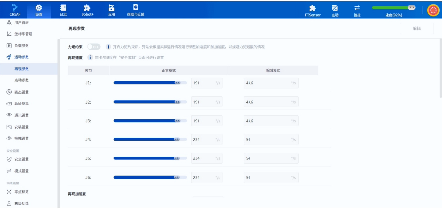
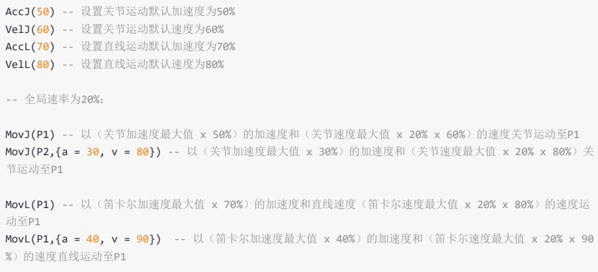

# 手臂二开md文档段落四

## 2.6 总线寄存器相关指令

# 指令列表

总线寄存器指令用于读写Profinet或Ethernet/IP总线寄存器。

| **指令**         | **功能**             | **指令类型** |
| -------------- | ------------------ | -------- |
| GetInputBool   | 获取输入寄存器指定地址的bool值  | 立即指令     |
| GetInputInt    | 获取输入寄存器指定地址的int值   | 立即指令     |
| GetInputFloat  | 获取输入寄存器指定地址的float值 | 立即指令     |
| GetOutputBool  | 获取输出寄存器指定地址的bool值  | 立即指令     |
| GetOutputInt   | 获取输出寄存器指定地址的int值   | 立即指令     |
| GetOutputFloat | 获取输出寄存器指定地址的float值 | 立即指令     |
| SetOutputBool  | 设置输出寄存器指定地址的bool值  | 立即指令     |
| SetOutputInt   | 设置输出寄存器指定地址的int值   | 立即指令     |
| SetOutputFloat | 设置输出寄存器指定地址的float值 | 立即指令     |

# GetInputBool

# 原型：

```
GetInputBool(address)
```

# 描述:

获取输入寄存器指定地址的bool类型的数值。

# 必选参数

| **参数名** | **类型** | **说明**                |
| ------- | ------ | --------------------- |
| address | int    | 寄存器地址, 取值范围: \[0,63]。 |

# 返回

```
ErrorID,{value},GetInputBool(address);
```

value表示指定的寄存器地址的值，为0或1。

# 示例：

```
GetInputBool(0)
```

读取输入寄存器地址位0的布尔值。

# GetInputInt

# 原型：

```
GetInputInt(address)
```

# 描述:

获取输入寄存器指定地址的int类型的数值。

# 必选参数

| **参数名** | **类型** | **说明**                |
| ------- | ------ | --------------------- |
| address | int    | 寄存器地址, 取值范围: \[0,23]。 |

# 返回

```
ErrorID, {value}, GetInputInt(address);
```

value表示指定的寄存器地址的值, 为整型数 (int32)。

# 示例：

```
GetInputInt(1)
```

读取输入寄存器地址位1的int值。

# GetInputFloat

# 原型：

```
GetInputFloat(address)
```

# 描述:

获取输入寄存器指定地址的float类型的数值。

# 必选参数

| **参数名** | **类型** | **说明**                |
| ------- | ------ | --------------------- |
| address | int    | 寄存器地址, 取值范围: \[0,23]。 |

# 返回

```
ErrorID,{value},GetInputFloat(address);
```

value表示指定的寄存器地址的值，为单精度浮点数 (float)

# 示例：

```
GetInputFloat(2)
```

读取输入寄存器地址位2的float值。

# GetOutputBool

# 原型：

```
GetOutputBool(address)
```

# 描述:

获取输出寄存器指定地址的bool类型的数值。

# 必选参数

| **参数名** | **类型** | **说明**                |
| ------- | ------ | --------------------- |
| address | int    | 寄存器地址, 取值范围: \[0,63]。 |

# 返回

```
ErrorID, {value}, GetOutputBool(address);
```

value表示指定的寄存器地址的值，为0或1。

# 示例：

```
GetOutputBool(0)
```

获取输出寄存器地址位0的布尔值。

# GetOutputInt

# 原型：

```
GetOutputInt(address)
```

# 描述:

获取输出寄存器指定地址的int类型的数值。

# 必选参数

| **参数名** | **类型** | **说明**                |
| ------- | ------ | --------------------- |
| address | int    | 寄存器地址, 取值范围: \[0,23]。 |

# 返回

```
ErrorID, {value}, GetOutputInt(address);
```

value表示指定的寄存器地址的值，为整型数 (int32)。

# 示例：

```
GetOutputInt(1)
```

读取输出寄存器地址位1的int值。

# GetOutputFloat

# 原型：

```
GetOutputFloat(address)
```

# 描述:

获取输出寄存器指定地址的float类型的数值。

# 必选参数

| **参数名** | **类型** | **说明**                |
| ------- | ------ | --------------------- |
| address | int    | 寄存器地址, 取值范围: \[0,23]。 |

# 返回

```
ErrorID, {value}, GetOutputFloat(address);
```

value表示指定的寄存器地址的值，为单精度浮点数（float）。

# 示例：

```
GetOutputFloat(2)
```

读取输出寄存器地址位2的float值。

# SetOutputBool

# 原型：

```
SetOutputBool(address,value)
```

# 描述:

设置输出寄存器指定地址的bool类型的数值。

# 必选参数

| **参数名** | **类型** | **说明**                |
| ------- | ------ | --------------------- |
| address | int    | 寄存器地址, 取值范围: \[0,63]。 |
| value   | int    | 要设置的值, 支持0或1。         |

# 返回

```
ErrorID, {},SetOutputBool(address, value);
```

# 示例：

```
SetOutputBool(0,0)
```

设置输出寄存器0的值为假。

# SetOutputInt

# 原型：

```
SetOutputInt(address,value)
```

# 描述:

设置输出寄存器指定地址的int类型的数值。

# 必选参数

| **参数名** | **类型** | **说明**                |
| ------- | ------ | --------------------- |
| address | int    | 寄存器地址, 取值范围: \[0,23]。 |
| value   | int    | 要设置的值, 支持带符号的32位整型数。  |

# 返回

```
ErrorID, {}, SetOutputInt(address, value);
```

# 示例：

```
SetOutputInt(1,123)
```

设置输出寄存器地址位1的值为123。

# SetOutputFloat

# 原型：

```
SetOutputFloat(address, value)
```

# 描述:

设置输出寄存器指定地址的float类型的数值。

# 必选参数

| **参数名** | **类型** | **说明**                |
| ------- | ------ | --------------------- |
| address | int    | 寄存器地址, 取值范围: \[0,23]。 |
| value   | float  | 要设置的值, 支持单精度浮点数。      |

# 返回

```
ErrorID, {}, SetOutputFloat(address, value);
```

# 示例：

```
SetOutputFloat(2,12.3)
```

设置输出寄存器地址位2的float值为12.3。

## 2.7 运动相关指令

# 参数格式

运动指令中点位参数和可选参数均为string类型, 格式为“key=value”, 例如 “joint = \{10, 10, 10, 0, 0, 0}”, “user=1”。为方便用户理解参数, 下文参数表中此类参数的类型列均表示value的类型。

# 运动方式

机器人支持的运动方式可分为下述几类。

# 关节运动

机器人根据当前各关节角度和目标点各关节角度的差值规划各个关节的运动，使各个关节同时完成运动。关节运动不约束TCP (Tool Center Point) 的运动轨迹，一般情况下该轨迹非直线。

当前点P1

关节运动不受奇异位置限制（奇异点位置详见机器人对应的硬件手册），因此如果对运动轨迹没有要求，或目标点位在奇异位置附近，建议使用关节运动。

# 直线运动

机器人根据当前位姿和目标点的位姿规划运动轨迹，使TCP运动轨迹为直线，且末端姿态在运动过程中匀速变化。

当前点P1

当运动轨迹会经过奇异位置时，下发直线运动指令给机器人会产生报错，建议重新规划点位或在奇异位置附近采用关节运动。

# 弧线运动

机器人通过当前位置，P1，P2三个不共线的点确定一个圆弧或整圆。运动过程中的机器人末端姿态通过当前点和P2点的姿态插补算出，P1点的姿态不参与运算（即运动过程中机器人到达P1点时的姿态可能与示教姿态不同）。

P1P1P2P2当前点当前点

当运动轨迹会经过奇异位置时，下发弧线运动指令给机器人会产生报错，建议重新规划点位或在奇异位置附近采用关节运动。

# 点位参数

如无特殊说明，运动指令中所有点位参数 (P) 都支持两种表达方式：

● 关节变量：使用各个机器人各个关节的角度（j1\~j6）表示目标点位。作为目标点时会通过正解变换为位姿变量再使用。

```
joint = {j1, j2, j3, j4, j5, j6}
```

●位姿变量:使用笛卡尔坐标(x, y, z)表示目标点位在用户坐标系中的空间位置,使用欧拉角(rx, ry, z)表示TCP (Tool Center Point)到达该点时工具坐标系相对于用户坐标系的旋转角度。

越疆机器人计算欧拉角时的旋转顺序为$X \to Y \to Z$，每个轴都是绕固定轴（用户坐标系）旋转，如下图所示（$rx=\gamma$，$ry=\beta$，$rz=\alpha$）。

2b2PBAC-8RA日B

确定了旋转顺序后，就可以将旋转矩阵（其中$\text{ca}$为$\cos\alpha$，$\text{sa}$为$\sin\alpha$的简写，以此类推）

​$\begin{aligned} \begin{bmatrix} \Lambda_B R_{XYZ}(\gamma, \beta, \alpha) &= R_Z(\alpha)R_\gamma(\beta)R_X(\gamma) \\ &= \begin{bmatrix} c\alpha & -s\alpha & 0 \\ s\alpha & c\alpha & 0 \\ 0 & 0 & 1 \end{bmatrix} \begin{bmatrix} c\beta & 0 & s\beta \\ 0 & 1 & 0 \\ -s\beta & 0 & c\beta \end{bmatrix} \begin{bmatrix} 1 & 0 & 0 \\ 0 & c\gamma & -s\gamma \\ 0 & s\gamma & c\gamma \end{bmatrix} \end{aligned}$​

推导为方程

​$A_B^A R_{XYZ}(\gamma, \beta, \alpha) = \begin{bmatrix} c \alpha c \beta & c \alpha s \beta s \gamma - s \alpha c \gamma & c \alpha s \beta c \gamma + s \alpha s \gamma \\ s \alpha c \beta & s \alpha s \beta s \gamma + c \alpha c \gamma & s \alpha s \beta c \gamma - c \alpha s \gamma \\ -s \beta & c \beta s \gamma & c \beta c \gamma \end{bmatrix}$​

通过该方程计算机机器人末端的姿态。

pose = \{x, y, z, rx, ry, rz}

# 坐标系参数

笛卡尔坐标系相关的运动指令，可选参数的user和tool用于指定目标点的用户和工具坐标系：

当前仅支持通过索引序号指定，需要先在控制软件中添加对应坐标系。

如果不携带user和tool参数,则使用全局用户和工具坐标系,详见设置相关指令中的user和tool指令说明(未调用指令设置时的默认坐标系均为0)。

# 运动参数

# 相对速率

可选参数中的a和v用于指定机器人执行该运动指令时的加速度和速度比例。

机器人实际运动速度 = 最大速度 x 全局速率 x 指令速率

机器人实际运动加速度 = 最大加速度 x 指令速率

其中最大速度/加速度受再现参数的控制，可在DobotStudio Pro的运动参数页面查看与修改。

> 2CRSAF日设置Dobot+帮助与反馈监控FTScnsor点动速度(92%)用户管理再现参数编辑坐标系管理负载参数力矩约东开启力矩约束后，算法会根据实际运行情况进行调整加速度和加加速度，以规避力矩超限的情况运动参数笛卡尔速度在“安全限制”页面可进行设置再现速度再现参数关节正常模式缩减模式点动参数J1:19143.615/5姿态设置J2:19143.6\*/s轨迹复现通讯设置J3:19143.60/s安装设置抱拽设置J4:54234安全设置J5:5423安全设置模式设置2J6:54234\*/s高级设置X零点标定再现加速度高级功能
>
> 
>
> ​

全局速率可通过DobotStudio Pro (上图右上角)或SpeedFactor指令设置。

指令速率为运动指令可选参数携带的比例，未通过可选参数指定运动加速度/速度比例时，默认使用运动参数中设置的值（详见VelJ，AccJ，VelL，AccL指令，未调用指令设置时的默认值均为100）。



​

例:

```
AccJ(50) --设置关节运动默认加速度为50%
VelJ(60) --设置关节运动默认速度为60%
AccL(70) --设置直线运动默认加速度为70%
VelL(80) --设置直线运动默认速度为80%
--全局速率为20%;
MovJ(P1)--以(关节加速度最大值x50%)的加速度和(关节速度最大值x20%x60%)的速度关节运动至P1
MovJ(P2,{a=30,v=80})--以(关节加速度最大值x30%)的加速度和(关节速度最大值x20%x80%)关节运动至P1
MovL(P1)--以(笛卡尔加速度最大值x70%)的加速度和直线速度(笛卡尔速度最大值x20%x80%)的速度运动至P1
MovL(P1,{a=40,v=90})--以(笛卡尔加速度最大值x40%)的加速度和(笛卡尔速度最大值x20% x 90%)的速度直线运动至P1
```

# 绝对速度

直线和弧线运动指令可选参数中的speed用于指定械臂执行该运动指令时的绝对速度。

绝对速度不受全局速率影响，但受再现参数中的最大速度限制（如果机器人进入了缩减模式，则受缩减后的最大速度限制），即speed参数设置的目标速度如果大于再现参数中的最大速度，则以最大速度为准。

例:

```
MovL(P1, {speed = 1000}) -- 以1000的绝对速率直线移动至P1
```

MovL设置了speed为1000，小于再现参数中的最大速度2000，则机器人会以1000mm/s为目标速度进行运动，该目标速度与此时的全局速率无关。但如果机器人处于缩减模式（假设缩减率为10%），则最大速度变为200，小于1000，此时机器人会以200mm/s为目标速度进行运动。

speed参数和v参数互斥，若同时存在以speed为准。

# 平滑过渡参数

机器人连续运动经过多个点时，可以通过平滑过渡的方式经过中间点，避免机器人拐弯过于生硬。如果用户指定的几个路径点基于不同的工具坐标系，则无法平滑过渡。

可选参数中的cp或r用于指定当前运动指令到下一条运动指令之间的平滑过渡比例（cp）或者平滑过渡半径（r），两者互斥，若同时存在以r为准。

# i 说明：

关节运动相关命令不支持设置平滑过渡半径（r），详见各指令的可选参数。

设置平滑过渡比例时，系统会自动计算过渡曲线的弧度，CP值越大曲线越平滑，如下图所示。CP过渡曲线会受运动速度/加速度影响，即使点位和CP值都相同，运动速度/加速度不同时的过渡曲线弧度也会不同。

CP=0P2CP=50%CP=100%P1P3

设置平滑过渡半径时，系统会以过渡点为圆心，根据指定半径计算过渡曲线。R过渡曲线不受运动速度/加速度影响，只由点位和过渡半径决定。

P2P1过渡曲线P3

如果用户设置的过渡半径过大(超过起始点/终点与过渡点之间的距离),则系统会自动使用起始点/终点与过渡点之间较短距离的一半作为过渡半径计算过渡曲线。

用户设置的r实际生效的

未通过可选参数指定平缓过渡比例或半径时，默认使用运动参数中设置的平滑过渡比例(详见CP指令，未调用指令设置时的默认值为0)。

# i说明:

平滑过渡会导致机器人运动不经过中间点，因此设置了平滑过渡时，两条运动指令之间IO信号输出或功能设置（例如开关安全皮肤）指令会在过渡过程中执行。

如果希望能够在机器人准确抵达中间点时执行指令，请将前一条指令的平滑过渡参数设置为0。

# 指令列表

| **指令**              | **功能**          | **指令类型** |
| ------------------- | --------------- | -------- |
| MovJ                | 关节运动            | 队列指令     |
| MovL                | 直线运动            | 队列指令     |
| MovLIO              | 直线运动并输出DO       | 队列指令     |
| MovJIO              | 关节运动并输出DO       | 队列指令     |
| Arc                 | 圆弧插补运动          | 队列指令     |
| ArclO               | 圆弧运动并输出DO       | 队列指令     |
| Circle              | 整圆插补运动          | 队列指令     |
| ServoJ              | 基于关节空间的动态跟随命令   | 队列指令     |
| ServoP              | 基于笛卡尔空间的动态跟随命令  | 队列指令     |
| MoveJog             | 点动机械臂           | 立即指令     |
| RunTo               | 运动至指定点位         | 立即指令     |
| GetStartPose        | 获取指定轨迹的第一个点位    | 立即指令     |
| MovS                | 拟合导入的轨迹         | 队列指令     |
| StartPath           | 复现录制的运动轨迹       | 队列指令     |
| RelMovJTool         | 沿工具坐标系进行相对关节运动  | 队列指令     |
| RelMovLTool         | 沿工具坐标系进行相对直线运动  | 队列指令     |
| RelMovJUser         | 沿用户坐标系进行相对关节运动  | 队列指令     |
| RelMovLUser         | 沿用户坐标系进行相对直线运动  | 队列指令     |
| RelJointMovJ        | 沿关节坐标系进行相对关节运动  | 队列指令     |
| RelPointTool        | 沿工具坐标系笛卡尔点偏移    | 立即指令     |
| RelPointUser        | 沿用户坐标系笛卡尔点偏移    | 立即指令     |
| RelJoint            | 关节点位偏移          | 立即指令     |
| GetCurrentCommandID | 获取当前执行指令的算法队列ID | 立即指令     |
| StartRTOffset       | 启动坐标系偏移         | 队列指令     |
| EndRTOffset         | 结束坐标系偏移         | 队列指令     |
| OffsetPara          | 设置坐标系偏移值        | 立即指令     |

# MovJ

# 原型

MovJ(P, user, tool, a, v, cp)

# 描述

从当前位置以关节运动方式运动至目标点。

# 必选参数

| **参数名** | **类型** | **说明**                                                                                      |
| ------- | ------ | ------------------------------------------------------------------------------------------- |
| p       | string | 目标点, 支持关节变量或位姿变量。格式为 "joint = \{j1, j2, j3, j4, j5, j6}" 或 "pose = \{x, y, z, rx, ry, rz}"。 |

# 可选参数

| **参数名** | **类型** | **说明**                                                |
| ------- | ------ | ----------------------------------------------------- |
| user    | string | 格式为"user=index", index为已标定的用户坐标系索引。取值范围:\[0,50]。      |
| tool    | string | 格式为"tool=index", index为已标定的工具坐标系索引。取值范围:\[0,50]。      |
| a       | string | 格式为"a=value"。value表示执行该条指令时的机器人运动加速度比例。取值范围:\[1,100]。 |
| v       | string | 格式为"v=value"。value表示执行该条指令时的机器人运动速度比例。取值范围:\[1,100]。  |
| cp      | string | 格式为"cp=value"。value表示平滑过渡比例。取值范围:\[0,100]。            |

# 返回

```
ErrorID,{\ResultID},MovJ(P,user,tool,a,v,cp);
```

ResultID为算法队列ID，可用于判断指令执行顺序。

# 示例

```
MovJ(pose={-500,100,200,150,0,90},user=1,tool=0, a=20, v=50, cp=100)
```

机器人从当前位置以50%速度，20%加速度，100%平滑过渡比例通过关节运动方式运动至笛卡尔坐标点\{-500,100,200,150,0,90}（用户坐标系1，工具坐标系0）。

# MovL

# 原型

```
MovL(P,user,tool,a,v|speed,cp|r)
```

# 描述

从当前位置以直线运动方式运动至目标点。

# 必选参数

| **参数名** | **类型** | **说明**                                                                                   |
| ------- | ------ | ---------------------------------------------------------------------------------------- |
| P       | string | 目标点, 支持关节变量或位姿变量。格式为"joint = \{j1, j2, j3, j4, j5, j6}"或"pose = \{x, y, z, rx, ry, rz}"。 |

# 可选参数

| **参数名** | **类型** | **说明**                                                                                    |
| ------- | ------ | ----------------------------------------------------------------------------------------- |
| user    | string | 格式为"user=index", index为已标定的用户坐标系索引。取值范围: \[0,50]。                                         |
| tool    | string | 格式为"tool=index", index为已标定的工具坐标系索引。取值范围: \[0,50]。                                         |
| a       | string | 格式为"a=value"。value表示执行该条指令时的机器人运动加速度比例。取值范围: \[1,100]。                                    |
| v       | string | 格式为"v=value"。value表示执行该条指令时的机器人运动速度比例,与speed互斥。取值范围: \[1,100]。                            |
| speed   | string | 格式为"speed=value"。value表示执行该条指令时的机器人运动目标速度,与v互斥,若同时存在以speed为准。取值范围: \[1,最大运动速度], 单位: mm/s。 |
| cp      | string | 格式为"cp=value"。value表示平滑过渡比例,与r互斥。取值范围: \[0,100]。                                          |
| r       | string | 格式为"r=value"。value表示平滑过渡半径,与cp互斥。若同时存在以r为准。单位: mm。                                        |

# 返回

```
ErrorID, {ResultID}, MovL(P, user, tool, a, v| speed, cp|r);
```

ResultID为算法队列ID，可用于判断指令执行顺序。

# 示例

```
MovL (pose={-500,100,200,150,0,90}, v=60)
```

机器人从当前位置以60%的速度通过直线运动方式运动至笛卡尔坐标点\{-500,100,200,150,0,90}。

# MovLIO

# 原型

```
MovLIO(P,{Mode,Distance,Index,Status},...,{Mode,Distance,Index,Status},user,tool,a,v|speed,cp|r)
```

# 描述

从当前位置以直线运动方式运动至目标点，运动时并行设置数字输出端口状态。

# 必选参数

| **参数名** | **类型** | **说明**                                                                                   |
| ------- | ------ | ---------------------------------------------------------------------------------------- |
| P       | string | 目标点, 支持关节变量或位姿变量。格式为"joint = \{j1, j2, j3, j4, j5, j6}"或"pose = \{x, y, z, rx, ry, rz}"。 |

\{Mode,Distance,Index,Status}为并行数字输出参数，用于设置当机器人运动到指定距离或百分比时，触发指定DO。可设置多组，最少设置一组数据；参数具体含义如下：

| **参数名**  | **类型** | **说明**                                                                                                                                                                          |
| -------- | ------ | ------------------------------------------------------------------------------------------------------------------------------------------------------------------------------- |
| Mode     | int    | 设置触发模式。0: 表示百分比触发1: 表示距离触发                                                                                                                                                      |
| Distance | int    | 运行指定的距离。当Mode为0时, Distance表示起始点与目标点之间距离的百分比; 取值范围: (0,100)。当Mode为1时, Distance表示离起始点或目标点的距离; 单位: mm。Distance为0时, 表示起点即触发。Distance为正数时, 表示离起点的百分比/距离。Distance为负数时, 表示离目标点的百分比/距离。 |
| Index    | int    | DO端子的编号。取值范围: \[1,24]或\[100,1000]。当取值范围为\[100,1000]时, 需要有拓展IO模块的硬件支持。不同机型, 取值范围有所差异。                                                                                            |
| Status   | int    | 要设置的DO状态, 0表示无信号 (DO关闭), 1表示有信号 (DO开启)。                                                                                                                                         |

# 可选参数

| **参数名** | **类型** | **说明**                                                                                 |
| ------- | ------ | -------------------------------------------------------------------------------------- |
| user    | string | 格式为"user=index", index为已标定的用户坐标系索引。取值范围:\[0,50]。                                       |
| tool    | string | 格式为"tool=index", index为已标定的工具坐标系索引。取值范围:\[0,50]。                                       |
| a       | string | 格式为"a=value"。value表示执行该条指令时的机器人运动加速度比例。取值范围:\[1,100]。                                  |
| v       | string | 格式为"v=value"。value表示执行该条指令时的机器人运动速度比例,与speed互斥。取值范围:\[1,100]。                          |
| speed   | string | 格式为"speed=value"。value表示执行该条指令时的机器人运动目标速度,与v互斥,若同时存在以speed为准。取值范围:\[1,最大运动速度],单位:mm/s。 |
| cp      | string | 格式为"cp=value"。value表示平滑过渡比例,与r互斥。取值范围:\[0,100]。                                        |
| r       | string | 格式为"r=value"。value表示平滑过渡半径,与cp互斥,若同时存在以r为准。单位:mm。                                      |

# 返回

```
ErrorID, {ResultID}, MovLIO(P, {Mode, Distance, Index, Status}, ..., {Mode, Distance, Index, Status}, user, tool, a, v | speed, cp | r);
```

ResultID为算法队列ID，可用于判断指令执行顺序。

# 示例1

​$\text{MovLIO}(\text{pose}=\{-500,100,200,150,0,90\},\{\text{0},\text{30},\text{2},\text{1}\})$​

机器人从当前位置通过直线运动方式运动至笛卡尔坐标点\{-500,100,200,150,0,90}，当运动到距离起点30%的位置时，将DO2设置为打开。

当前点P1DO2=ON30%

# 示例2

​$\text{MovLIO}(\text{pose}=\{-500,100,200,150,0,90\},\{ 1,\ -15,\ 3,\ \emptyset\})$​

机器人从当前位置通过直线运动方式运动至笛卡尔坐标点\{-500,100,200,150,0,90}，当运动到距离终点15mm的位置时，将DO3设置为关闭。

P1当前点DO3=OFF15mm

# MovJIO

# 原型

```
MovJIO(P,{Mode,Distance,Index,Status},...,{Mode,Distance,Index,Status},user,tool,a,v,cp)
```

# 描述

从当前位置以关节运动方式运动至目标点，运动时并行设置数字输出端口状态。

# 必选参数

| **参数名** | **类型** | **说明**                                                                                   |
| ------- | ------ | ---------------------------------------------------------------------------------------- |
| P       | string | 目标点, 支持关节变量或位姿变量。格式为"joint = \{j1, j2, j3, j4, j5, j6}"或"pose = \{x, y, z, rx, ry, rz}"。 |

\{Mode,Distance,Index,Status}为并行数字输出参数，用于设置当机器人运动到指定距离或百分比时，触发指定DO。可设置多组，最少设置一组数据；参数具体含义如下：

| **参数名**  | **类型** | **说明**                                                                                                                                                                          |
| -------- | ------ | ------------------------------------------------------------------------------------------------------------------------------------------------------------------------------- |
| Mode     | int    | 设置触发模式。0: 表示百分比触发1: 表示距离触发                                                                                                                                                      |
| Distance | int    | 运行指定的距离。当Mode为0时, Distance表示起始点与目标点之间距离的百分比; 取值范围: (0,100)。当Mode为1时, Distance表示离起始点或目标点的距离; 单位: mm。Distance为0时, 表示起点即触发。Distance为正数时, 表示离起点的百分比/距离。Distance为负数时, 表示离目标点的百分比/距离。 |
| Index    | int    | DO端子的编号。取值范围: \[1,24]或\[100,1000]。当取值范围为\[100,1000]时, 需要有拓展IO模块的硬件支持。不同机型, 取值范围有所差异。                                                                                            |
| Status   | int    | 要设置的DO状态, 0表示无信号 (DO关闭), 1表示有信号 (DO开启)。                                                                                                                                         |

# 可选参数

| **参数名** | **类型** | **说明**                                                 |
| ------- | ------ | ------------------------------------------------------ |
| user    | string | 格式为“user=index”, index为已标定的用户坐标系索引。取值范围: \[0,50]。      |
| tool    | string | 格式为“tool=index”, index为已标定的工具坐标系索引。取值范围: \[0,50]。      |
| a       | int    | 格式为“a=value”。value表示执行该条指令时的机器人运动加速度比例。取值范围: \[1,100]。 |
| v       | int    | 格式为“v=value”。value表示执行该条指令时的机器人运动速度比例。取值范围: \[1,100]。  |
| cp      | int    | 格式为“cp=value”。value表示平滑过渡比例。取值范围: \[0,100]。            |

# 返回

```
ErrorID, {ResultID}, MovJIO(P, {Mode, Distance, Index, Status}, ..., {Mode, Distance, Index, Status}, user, tool, a, v, cp);
```

ResultID为算法队列ID，可用于判断指令执行顺序。

# 示例1

​$\text{MovJIO}(\text{pose}=\{-500,100,200,150,0,90\},\{0,30,2,1\})$​

机器人从当前位置通过关节运动方式运动至笛卡尔坐标点\{-500,100,200,150,0,90}\$，当运动到距离起点30%的位置时，将DO2设置为打开。

P1当前点(关节角合成量(关节角合成量DO2=ON30%

# 示例2

​$\text{MovJIO}(\text{pose}=\{-500,100,200,150,0,90\},\{ 1,\ -15,\ 3,\ 0\})$​

机器人从当前位置通过关节运动方式运动至笛卡尔坐标点\{-500,100,200,150,0,90}，当运动到距离终点还有15°的位置时，将DO3设置为关闭。

P1当前点(关节角合成量(关节角合成量DO3=OFF150

# Arc

# 原型

```
Arc(P1,P2,user,tool,a,v|speed,cp|r,mode)
```

# 描述

从当前位置以圆弧插补方式运动至目标点。

需要通过当前位置，圆弧中间点，运动目标点三个点确定一个圆弧，因此当前位置不能在P1和P2确定的直线上。

P1当前点P2

运动过程中的机械臂末端姿态通过当前点和P2点的姿态插补算出，P1点的姿态不参与运算（即运动过程中机械臂到达P1点时的姿态可能与示教姿态不同）。

# 必选参数

| **参数名** | **类型** | **说明**                                                                                        |
| ------- | ------ | --------------------------------------------------------------------------------------------- |
| P1      | string | 圆弧中间点, 支持关节变量或位姿变量。格式为 "joint = \{j1, j2, j3, j4, j5, j6}" 或 "pose = \{x, y, z, rx, ry, rz}”。 |
| P2      | string | 运动目标点, 支持关节变量或位姿变量。格式为 "joint = \{j1, j2, j3, j4, j5, j6}" 或 "pose = \{x, y, z, rx, ry, rz}”。 |

# 可选参数

| **参数名** | **类型** | **说明**                                                                                                                                                                                                                                                                                                                           |
| ------- | ------ | -------------------------------------------------------------------------------------------------------------------------------------------------------------------------------------------------------------------------------------------------------------------------------------------------------------------------------- |
| user    | string | 格式为"user=index", index为已标定的用户坐标系索引。取值范围: \[0,50]。                                                                                                                                                                                                                                                                                |
| tool    | string | 格式为"tool=index", index为已标定的工具坐标系索引。取值范围: \[0,50]。                                                                                                                                                                                                                                                                                |
| a       | string | 格式为"a=value"。value表示执行该条指令时的机械臂运动加速度比例。取值范围: \[1,100]。                                                                                                                                                                                                                                                                           |
| v       | string | 格式为"v=value"。value表示执行该条指令时的机械臂运动速度比例。取值范围: \[1,100]。                                                                                                                                                                                                                                                                            |
| speed   | string | 格式为"speed=value"。value表示执行该条指令时的机械臂运动目标速度,与v互斥,若同时存在以speed为准。取值范围: \[1,最大运动速度], 单位: mm/s。                                                                                                                                                                                                                                        |
| cp      | string | 格式为"cp=value"。value表示平滑过渡比例,与r互斥。取值范围: \[0,100]。                                                                                                                                                                                                                                                                                 |
| r       | string | 格式为"r=value"。value表示平滑过渡半径,与cp互斥,若同时存在以r为准。单位:mm。平滑过渡会改变机械臂运动轨迹,对DO输出的时机造成影响,请谨慎使用。                                                                                                                                                                                                                                              |
| mode    | int    | 格式为"mode=value"。通过设置姿态控制参数,对插补过程中机器人相对圆弧的姿态进行自适应控制,满足不同场景的使用需求。取值范围: \[0,2]。• mode=0: 线性模式。从当前姿态插值到P2目标位姿,忽略P1姿态。该模式下,只能实现小于$180^{\circ}$的姿态变化。适用于对机器人姿态无要求的场合。• mode=1: 过中间点模式。从当前姿态开始,经过中间点位姿,插值到P2目标位姿。主要用于焊接应用中。• mode=2: 固定模式。从当前姿态开始,TCP保持相对于圆弧切线的方向不变,忽略P1和P2姿态。该模式下,姿态旋转角度与圆弧角度一致,可实现超过$180^{\circ}$的姿态变化。主要用于涂胶、打磨等应用中。 |

P2P2P2P1P1P1Current PoseCurrent PoseCurrent Pose线性模式过中间点模式固定模式示教姿态实际轨迹姿态

# i 说明：

· 当设置为mode=1（过中间点模式）时，为了保证圆弧运动速度的均匀性，示教圆弧轨迹时，尽可能保证中间点的位置处于实际圆弧的一半。

●当设置为mode=1(过中间点模式)时，需要适当调整各点姿态，保证起始点到中间点的姿态变化与中间点到目标点的姿态变化角度接近。否则所构造的姿态曲线可能超出机器人的可达范围，运行时会报错。

# 返回

```
ErrorID,{ResultID},Arc(P1,P2,user,tool,a,v|speed,cp|r,mode);
```

ResultID为算法队列ID，可用于判断指令执行顺序。

# 示例

```
Arc(pose={-350,-200,200,150,0,90},pose={-300,-250,200,150,0,90})
```

机器人从当前位置通过圆弧运动方式经由笛卡尔坐标点\{-350,-200,200,150,0,90}运动至笛卡尔坐标点\{-300,-250,200,150,0,90}。

# ArcIO

# 原型：

```
ArcIO(P1,P2,{Mode,Distance,Index,Status},...,{Mode,Distance,Index,Status},user,tool,a,v|speed,
cp|r,mode)
```

# 描述:

在圆弧插补过程中并行输出指定DO信号。适用于涂胶应用场景，控制涂胶头的提前出胶和提前收胶（如音响涂胶，轨迹主要为圆弧）。

需要通过当前点，P1，P2三个点确定一个圆弧，因此当前位置不能在P1和P2确定的直线上。

P1P2当前点

# 必选参数：

| **参数名** | **类型** | **说明**                                                                                     |
| ------- | ------ | ------------------------------------------------------------------------------------------ |
| P1      | string | 圆弧中间点, 支持关节变量或位姿变量。格式为"joint = \{j1, j2, j3, j4, j5, j6}"或"pose = \{x, y, z, rx, ry, rz}"。 |
| P2      | string | 运动目标点, 支持关节变量或位姿变量。格式为"joint = \{j1, j2, j3, j4, j5, j6}"或"pose = \{x, y, z, rx, ry, rz}"。 |

\{Mode,Distance,Index,Status}为并行数字输出参数，用于设置当机器人运动到指定距离或百分比时，触发指定DO。可设置多组，最少设置一组数据；参数具体含义如下：

| **参数名**  | **类型** | **说明**                                                                                                                                                                          |
| -------- | ------ | ------------------------------------------------------------------------------------------------------------------------------------------------------------------------------- |
| Mode     | int    | 设置触发模式。0: 表示百分比触发1: 表示距离触发                                                                                                                                                      |
| Distance | int    | 运行指定的距离。当Mode为0时, Distance表示起始点与目标点之间距离的百分比; 取值范围: (0,100)。当Mode为1时, Distance表示离起始点或目标点的距离; 单位: mm。Distance为0时, 表示起点即触发。Distance为正数时, 表示离起点的百分比/距离。Distance为负数时, 表示离目标点的百分比/距离。 |
| Index    | int    | DO端子的编号。取值范围: \[1,24]或\[100,1000]。当取值范围为\[100,1000]时, 需要有拓展IO模块的硬件支持。不同机型, 取值范围有所差异。                                                                                            |
| Status   | int    | 要设置的DO状态, 0表示无信号 (DO关闭), 1表示有信号 (DO开启)。                                                                                                                                         |

# 可选参数:

| **参数名** | **类型** | **说明**                                                                                                                                                                                                                                                                                               |
| ------- | ------ | ---------------------------------------------------------------------------------------------------------------------------------------------------------------------------------------------------------------------------------------------------------------------------------------------------- |
| user    | string | 格式为"user=index", index为已标定的用户坐标系索引。取值范围:\[0,50]。                                                                                                                                                                                                                                                     |
| tool    | string | 格式为"tool=index", index为已标定的工具坐标系索引。取值范围:\[0,50]。                                                                                                                                                                                                                                                     |
| a       | string | 格式为"a=value"。value表示执行该条指令时的机械臂运动加速度比例。取值范围:\[1,100]。                                                                                                                                                                                                                                                |
| v       | string | 格式为"v=value"。value表示执行该条指令时的机械臂运动速度比例。取值范围:\[1,100]。                                                                                                                                                                                                                                                 |
| speed   | string | 格式为"speed=value"。value表示执行该条指令时的机械臂运动目标速度,与v互斥,若同时存在以speed为准。取值范围:\[1,最大运动速度],单位:mm/s。                                                                                                                                                                                                               |
| cp      | string | 格式为"cp=value"。value表示平滑过渡比例,与r互斥。取值范围:\[0,100]。                                                                                                                                                                                                                                                      |
| r       | string | 格式为"r=value"。value表示平滑过渡半径,与cp互斥,若同时存在以r为准。单位:mm。平滑过渡会改变机械臂运动轨迹,对DO输出的时机造成影响,请谨慎使用。                                                                                                                                                                                                                  |
| mode    | int    | 格式为"mode=value"。通过设置姿态控制参数,对插补过程中机器人相对圆弧的姿态进行自适应控制,满足不同场景的使用需求。取值范围:\[0,2]。mode=0:线性模式。从当前姿态插值到P2目标位姿,忽略P1姿态。该模式下,只能实现小于180°的姿态变化。适用于对机器人姿态无要求的场合。mode=1:过中间点模式。从当前姿态开始,经过中间点位姿,插值到P2目标位姿。主要用于焊接应用中。mode=2:固定模式。从当前姿态开始,TCP保持相对于圆弧切线的方向不变,忽略P1和P2姿态。该模式下,姿态旋转角度与圆弧角度一致,可实现超过180°的姿态变化。主要用于涂胶、打磨等应用中。 |

P2P2P2P1P1P1Current PoseCurrent PoseCurrent Pose线性模式过中间点模式固定模式示教姿态实际轨迹姿态

# i说明:

●当设置为mode=1(过中间点模式)时，为了保证圆弧运动速度的均匀性，示教圆弧轨迹时，尽可能保证中间点的位置处于实际圆弧的一半。

● 当设置为mode=1(过中间点模式)时，需要适当调整各点姿态，保证起始点到中间点的姿态变化与中间点到目标点的姿态变化角度接近。否则所构造的姿态曲线可能超出机器人的可达范围，运行时会报错。

# ▲注意:

若Mode为0，Distance不在\[0,100]范围内，会报参数超限错误。

# 示例：

```
ArcIO(pose={-1140.580322,-31.398853,93.642189,10.629999,21.659998,-86.040001},pose={-1220.2070,31,-281.265533,93.642189,10.629999,21.659998,-86.040001},{0,25,1,1},{0,50,2,1},{0,75,3,1},{0,1,00,4,1},user=1,tool=2,a=20,v=50,cp=100)
```

机械臂经中间点P1向目标点P2进行圆弧运动，当运动到距离起点25%的位置时，将DO1设置为开。当运动到距离起点50%的位置时，将DO2设置为开。当运动到距离起点75%的位置时，将DO3设置为开。当运动到终点位置时，将DO4设置为开。

# Circle

# 原型

```
Circle(P1,P2,count,user,tool,a,v|speed,cp|r,mode)
```

# 描述

从当前位置进行整圆插补运动，运动指定圈数后重新回到当前位置。

需要通过当前位置，P1，P2三个点确定一个整圆，因此当前位置不能在P1和P2确定的直线上，且三个点确定的整圆不能超出机器人的运动范围。

P1P2当前点

运动过程中的机械臂末端姿态通过当前点和P2点的姿态插补算出，P1点的姿态不参与运算（即运动过程中机械臂到达P1点时的姿态可能与示教姿态不同）。

# 必选参数

| **参数名** | **类型** | **说明**                                                                                      |
| ------- | ------ | ------------------------------------------------------------------------------------------- |
| P1      | string | 整圆中间点, 支持关节变量或位姿变量。格式为"joint = \{j1, j2, j3, j4, j5, j6}"或"pose = \{x, y, z, rx, ry, rz}"。  |
| P2      | string | 整圆结束点点, 支持关节变量或位姿变量。格式为"joint = \{j1, j2, j3, j4, j5, j6}"或"pose = \{x, y, z, rx, ry, rz}"。 |
| count   | int    | 进行整圆运动的圈数, 取值范围: \[1,999]。                                                                  |

# 可选参数

| **参数名** | **类型** | **说明**                                                                                                                                                                                                                                                                                                                          |
| ------- | ------ | ------------------------------------------------------------------------------------------------------------------------------------------------------------------------------------------------------------------------------------------------------------------------------------------------------------------------------- |
| user    | string | 格式为"user=index", index为已标定的用户坐标系索引。取值范围: \[0,50]。                                                                                                                                                                                                                                                                               |
| tool    | string | 格式为"tool=index", index为已标定的工具坐标系索引。取值范围: \[0,50]。                                                                                                                                                                                                                                                                               |
| a       | string | 格式为"a=value"。value表示执行该条指令时的机械臂运动加速度比例。取值范围: \[1,100]。                                                                                                                                                                                                                                                                          |
| v       | string | 格式为"v=value"。value表示执行该条指令时的机械臂运动速度比例。取值范围: \[1,100]。                                                                                                                                                                                                                                                                           |
| speed   | string | 格式为“speed=value”。value表示执行该条指令时的机械臂运动目标速度,与v互斥,若同时存在以speed为准。取值范围:\[1,最大运动速度],单位:mm/s。                                                                                                                                                                                                                                          |
| cp      | string | 格式为“cp=value”。value表示平滑过渡比例,与r互斥。取值范围:\[0,100]。                                                                                                                                                                                                                                                                                 |
| r       | string | 格式为“r=value”。value表示平滑过渡半径,与cp互斥,若同时存在以为准。单位:mm。平滑过渡会改变机械臂运动轨迹,对DO输出的时机造成影响,请谨慎使用。                                                                                                                                                                                                                                              |
| mode    | int    | 格式为“mode=value”。通过设置姿态控制参数,对插补过程中机器人相对圆弧的姿态进行自适应控制,满足不同场景的使用需求。取值范围:\[0,2]。• mode=0: 线性模式。从当前姿态插值到P2目标位姿,忽略P1姿态。该模式下,只能实现小于$180^{\circ}$的姿态变化。适用于对机器人姿态无要求的场合。• mode=1: 过中间点模式。从当前姿态开始,经过中间点位姿,插值到P2目标位姿。主要用于焊接应用中。• mode=2: 固定模式。从当前姿态开始,TCP保持相对于圆弧切线的方向不变,忽略P1和P2姿态。该模式下,姿态旋转角度与圆弧角度一致,可实现超过$180^{\circ}$的姿态变化。主要用于涂胶、打磨等应用中。 |

# 返回

```
ErrorID,{ResultID},Circle(P1,P2,count,user,tool,a,v|speed,cp|r,mode);
```

ResultID为算法队列ID，可用于判断指令执行顺序。

# 示例

```
Circle(pose={-350,-200,200,150,0,90},pose={-300,-250,200,150,0,90},1)
```

机器人从当前位置经由笛卡尔坐标点\{-350,-200,200,150,0,90}和\{-300,-250,200,150,0,90}整圆运动一圈。

# ServoJ

# 原型

```
ServoJ(J1,J2,J3,J4,J5,J6,t,aheadtime,gain)
```

# 描述

基于关节空间的动态跟随命令，一般用于在线控制的寸动功能，通过循环调用实现动态跟随。调用频率建议设置为33Hz，即循环调用的间隔时间为30ms。

# 注意：

该指令不受全局速率影响，但受速度限制约束。

t值设置过小时，机器人执行指令时会因为速度限制无法满足指定的t。

调用该指令前建议对运行点位进行速度规划，按照固定时间间隔t下发速度规划后的点位，保证机器人能平稳跟踪目标点位。

# 必选参数

| **参数名**           | **类型** | **说明**                      |
| ----------------- | ------ | --------------------------- |
| J1,J2,J3,J4,J5,J6 | double | 点J1,J2,J3,J4,J5,J6轴位置，单位：度。 |

# 可选参数

| **参数名**   | **类型** | **说明**                                                                              |
| --------- | ------ | ----------------------------------------------------------------------------------- |
| t         | float  | 格式为“t=value”。value表示该点位的运行时间，单位：s，取值范围:\[0.004,3600.0]，默认值0.1。                      |
| aheadtime | float  | 格式为“aheadtime=value”。value表示提前量，作用类似于PID控制中的D项。标量，无单位，取值范围：\[20.0,100.0]，默认值50。     |
| gain      | float  | 格式为“gain=value”。value表示目标位置的比例增益，作用类似于PID控制中的P项。标量，无单位，取值范围：\[200.0,1000.0]，默认值500。 |

aheadtime和gain参数共同决定机器人运动的响应时间和轨迹平滑度，较小的aheadtime值或较大的gain值能使机器人快速响应，但可能造成不稳定和抖动。

# 返回

```
ErrorID,{ResultID},ServoJ(J1,J2,J3,J4,J5,J6,t,aheadtime,gain)；
```

ResultID为算法队列ID，可用于判断指令执行顺序。

# 示例

```
ServoJ(0,0,-90,0,90,0,t=0.1,aheadtime=50,gain=500)
// 间隔30ms循环调用，每次第三个参数加1
ServoJ(0,0,-89,0,90,0,t=0.1,aheadtime=50,gain=500)
```

J3轴进行步伐为1度的寸动。

# ServoP

# 原型

```
ServoP(X,Y,Z,Rx,Ry,Rz,t,aheadtime,gain)
```

# 描述

基于笛卡尔空间的动态跟随命令，一般用于在线控制的寸动功能，通过循环调用实现动态跟随。调用频率建议设置为33Hz，即循环调用的间隔时间为30ms。

# 注意：

该指令不受全局速率影响，但受速度限制约束。

t值设置过小时，机器人执行指令时会因为速度限制无法满足指定的t。

调用该指令前建议对运行点位进行速度规划，按照固定时间间隔t下发速度规划后的点位，保证机器人能平稳跟踪目标点位。

# 必选参数

| **参数名**        | **类型** | **说明**                                                                             |
| -------------- | ------ | ---------------------------------------------------------------------------------- |
| X,Y,Z,Rx,Ry,Rz | double | 目标点位位姿变量。X,Y,Z单位：毫米，Rx,Ry,Rz单位：度。参考坐标系为全局用户和工具坐标系，详见设置相关指令中的User和Tool指令说明（默认值均为0）。 |

# 可选参数

| **参数名**   | **类型** | **说明**                                                                              |
| --------- | ------ | ----------------------------------------------------------------------------------- |
| t         | float  | 格式为“t=value”。value表示该点位的运行时间，单位：s，取值范围：\[0.004,3600.0]，默认值0.1。                      |
| aheadtime | float  | 格式为“aheadtime=value”。value表示提前量，作用类似于PID控制中的D项。标量，无单位，取值范围：\[20.0,100.0]，默认值50。     |
| gain      | float  | 格式为“gain=value”。value表示目标位置的比例增益，作用类似于PID控制中的P项。标量，无单位，取值范围：\[200.0,1000.0]，默认值500。 |

aheadtime和gain参数共同决定机器人运动的响应时间和轨迹平滑度，较小的aheadtime值或较大的gain值能使机器人快速响应，但可能造成不稳定和抖动。

# 返回

```
ErrorID,{ResultID},ServoP(X,Y,Z,Rx,Ry,Rz,t,aheadtime,gain);
```

ResultID为算法队列ID，可用于判断指令执行顺序。

# 示例

```
ServoP(-500,100,200,150,0,90）
// 间隔30ms循环调用，每次第一个参数加1
ServoP(-499,100,200,150,0,90）
```

沿X轴进行步伐为1mm的寸动。

# MoveJog

# 原型

```
MoveJog(axisID,coordtype,user,tool)
```

# 描述

点动或停止点动机器人。下发命令后机器人会沿指定轴持续点动，需要再下发MoveJog()停止机器人运动。另外，机器人点动时下发携带任意非指定string的MoveJog(string)也会使机器人停止运动。

该指令为立即指令，支持在工程暂停时调用。

# 必选参数

| **参数名** | **类型** | **说明**                                                                                                                                                                                                                                                                                                                                                                                          |
| ------- | ------ | ----------------------------------------------------------------------------------------------------------------------------------------------------------------------------------------------------------------------------------------------------------------------------------------------------------------------------------------------------------------------------------------------- |
| axisID  | string | 点动运动轴，请注意大小写。不携带或携带错误的参数表示停止点动机器人 J1+ 表示关节1正方向运动， J1- 表示关节1负方向运动 J2+ 表示关节2正方向运动， J2- 表示关节2负方向运动 J3+ 表示关节3正方向运动，J3- 表示关节3负方向运动 J4+ 表示关节4正方向运动，J4- 表示关节4负方向运动 J5+ 表示关节5正方向运动，J5- 表示关节5负方向运动 J6+ 表示关节6正方向运动，J6- 表示关节6负方向运动 X+ 表示X轴正方向运动，X- 表示X轴负方向运动 Y+ 表示Y轴正方向运动，Y- 表示Y轴负方向运动 Z+ 表示Z轴正方向运动，Z- 表示Z轴负方向运动 Rx+ 表示Rx轴正方向运动，Rx- 表示Rx轴负方向运动 Ry+ 表示Ry轴正方向运动，Ry- 表示Ry轴负方向运动 Rz+ 表示Rz轴正方向运动，Rz- 表示Rz轴负方向运动 |

# 可选参数

| **参数名**   | **类型** | **说明**                                                                                                                                                                     |
| --------- | ------ | -------------------------------------------------------------------------------------------------------------------------------------------------------------------------- |
| coordtype | string | 格式为“coordtype=value”。value表示指定运动轴所属的坐标系。0表示关节点动，1表示用户坐标系，2表示工具坐标系。默认值为上次成功调用时的设置值。 当axisID为关节轴时，coordtype只能取值0（忽略用户携带的该参数）。 当axisID为笛卡尔坐标轴时，coordtype只能取值1或2，取值为0会返回错误码-6。 |
| user      | string | 格式为"user=index"，index为已标定的用户坐标系索引。取值范围：\[0,50]。                                                                                                                            |
| tool      | string | 格式为"tool=index"，index为已标定的工具坐标系索引。取值范围：\[0,50]。                                                                                                                            |

# 返回

```
ErrorID,{},MoveJog(axisID,coordtype,user,tool);
```

# 示例1

```
MoveJog(J2-)
// 停止点动
MoveJog()
```

沿J2轴负方向点动，然后停止点动。

# 示例2

```
MoveJog(X+,coordtype=1,user=1)
// 停止点动
MoveJog()
```

沿用户坐标系1的X轴正方向点动，然后停止点动。

# 示例3

```
MoveJog(J2-,coordtype=1,user=1)
// 停止点动
MoveJog()
```

沿J2轴负方向点动，然后停止点动。axisID指定关节时，可选参数无效。

# RunTo

# 原型

```
RunTo(P,moveType,user,tool,a,v)
```

# 描述

从当前位置运动至目标点。

该指令为立即指令，支持在工程暂停时调用。

# 必选参数

| **参数名** | **类型** | **说明**                                                                                  |
| ------- | ------ | --------------------------------------------------------------------------------------- |
| P       | string | 目标点，支持关节变量或位姿变量。格式为"joint = \{j1, j2, j3, j4, j5, j6}"或"pose = \{x, y, z, rx, ry, rz}"。 |

# 可选参数

| **参数名**  | **类型** | **说明**                                                                                                                                                                                                     |
| -------- | ------ | ---------------------------------------------------------------------------------------------------------------------------------------------------------------------------------------------------------- |
| moveType | string | 设置运动类型，参数格式为“moveType=value”。取值范围\[0,4]，默认值为1（直线运动）。 moveType=0：关节运动； moveType=1：直线运动； moveType=2：关节运动至指定偏移角度； moveType=3：沿工具坐标系进行相对直线运动（必须使用位姿变量，不能使用关节变量）； moveType=4：沿用户坐标系进行相对直线运动（必须使用位姿变量，不能使用关节变量）。 |
| user     | string | 格式为"user=index"，index为已标定的用户坐标系索引。取值范围：\[0,50]。                                                                                                                                                            |
| tool     | string | 格式为"tool=index"，index为已标定的工具坐标系索引。取值范围：\[0,50]。                                                                                                                                                            |
| a        | string | 格式为“a=value”。value表示执行该条指令时的机械臂运动加速度比例。取值范围：\[1,100]。                                                                                                                                                      |
| v        | string | 格式为“v=value”。value表示执行该条指令时的机械臂运动速度比例。取值范围：\[1,100]。                                                                                                                                                       |

# 返回

```
ErrorID,{},RunTo(P,moveType,user,tool,a,v);
```

# 示例1

```
RunTo(joint = {0, 0, 90, 0, 90, 90}, moveType = 0, a = 20, v = 50)
```

机器人从当前位置以50%速度，20%加速度通过关节运动方式运动至关节坐标\{0, 0, 90, 0, 90,90}。

# 示例2

```
RunTo(pose= {-500,100,200,150,0,90}, moveType = 1, user = 1, tool = 0, a = 20, v = 50)
```

机器人从当前位置以50%速度，20%加速度通过直线运动方式运动至笛卡尔坐标点\{-500,100,200,150,0,90}（用户坐标系1，工具坐标系0）。

# MovS

# 原型：

```
MovS(P1,P2,P3,... ,user,tool,a,v|speed,freq)
MovS(file,user,tool,a,v|speed,freq)
```

# 描述:

拟合指定的轨迹。调用该指令前需要用户自行运行机械臂到轨迹的起始点。

# 可选参数

| **参数名**     | **类型** | **说明**                                                                                                                                       |
| ----------- | ------ | -------------------------------------------------------------------------------------------------------------------------------------------- |
| P1,P2,P3... | string | 待拟合的点位，支持关节点位或位姿点位。格式为"joint = \{j1,j2, j3, j4, j5, j6}"或"pose = \{x, y, z, rx, ry, rz}"。点位数量范围是\[4, 50]。                                    |
| file        | string | 待拟合的轨迹文件,格式为"file=x.csv"，代表一个轨迹文件的名字（含后缀名）。                                                                                                  |
| user        | string | 指定轨迹点位对应的用户坐标系索引，不指定时使用轨迹文件中记录的用户坐标系索引。具有最高优先级的可选参数。格式为"user=index"，index为已标定的用户坐标系索引。取值范围：\[0,50]。                                          |
| tool        | string | 指定轨迹点位对应的工具坐标系索引，不指定时使用轨迹文件中记录的工具坐标系索引。具有最高优先级的可选参数。格式为"tool=index"，index为已标定的工具坐标系索引。取值范围：\[0,50]。                                          |
| a           | string | 格式为“a=value”。value表示执行该条指令时的机器人运动加速度比例。取值范围：\[1,100]。                                                                                        |
| v           | string | 格式为“v=value”。value表示执行该条指令时的机器人运动速度比例，与speed互斥。取值范围：\[1,100]。                                                                                |
| speed       | string | 格式为“speed=value”。value表示执行该条指令时的机器人运动目标速度，与v互斥，若同时存在以speed为准。取值范围：\[1, 最大运动速度]，单位：mm/s。                                                      |
| freq        | string | 滤波系数，格式为“freq=value”。值越小，拟合的轨迹曲线越平滑，但相对原轨迹的变形越严重，请根据原轨迹的平滑程度设置合适的滤波系数。取值范围：（0,1]，默认1（表示关闭滤波）。 CAD输出的轨迹可以设置为1，保证精度；如果是3D相机等曲线，建议打开滤波，保证曲线的平滑。 |

# 注意：

该指令必须输入点位列表P1,P2,P3,...或轨迹文件file其中一个参数。

# 返回

```
ErrorID,{},MovS(P1,P2,P3,... ,user,tool,a,v|speed,freq);
ErrorID,{},MovS(file,user,tool,a,v|speed,freq);
```

# 示例

```
MovS(pose={100,0,100,0,0,0},pose={100,20,100,0,0,0},pose={100,30,100,0,0,0}，pose={100,40,100,0,0,0})
```

# GetStartPose

# 原型

```
GetStartPose(traceName,pathType)
```

# 描述

获取指定轨迹的第一个点位。

# 必选参数

| **参数名**   | **类型** | **说明**                                                                                                                                                |
| --------- | ------ | ----------------------------------------------------------------------------------------------------------------------------------------------------- |
| traceName | string | 轨迹文件名（含后缀.csv）。 轨迹文件存放在/dobot/userdata/project/process/trajectory/或 /dobot/userdata/project/process/track/。 如果名称包含中文，必须将发送端的编码方式设置为UTF-8，否则会导致中文接收异常。 |

# 可选参数

| **参数名**  | **类型** | **说明**                                                                                                                                   |
| -------- | ------ | ---------------------------------------------------------------------------------------------------------------------------------------- |
| pathType | int    | 轨迹的类型，可不填或者1、2。 1：默认值，用于复现的轨迹，轨迹存放在/dobot/userdata/project/process/trajectory/。 2：用于拟合的轨迹，轨迹文件存放在/dobot/userdata/project/process/track/。 |

# 返回

```
ErrorID,{pointtype,{j1,j2,j3,j4,j5,j6},user,tool,{x,y,z,rx,ry,rz}},GetStartPose(traceName,path Type);
```

其中pointtype表示返回点位的类型，0：示教点，1：关节变量，2：位姿变量。根据点位类型不同，携带的点位数据也有所不同，示例如下：

```
ErrorID,{0,{j1,j2,j3,j4,j5,j6},user,tool,{x,y,z,rx,ry,rz}},GetStartPose(traceName); // 示教点
ErrorID,{1,{j1,j2,j3,j4,j5,j6}},GetStartPose(traceName); // 关节变量
ErrorID,{2,{x,y,z,rx,ry,rz}},GetStartPose(traceName); // 位姿变量
ErrorID,{2,{x,y,z,rx,ry,rz}},GetStartPose(traceNamel,2);// 位姿变量
```

# 示例

```
GetStartPose(recv_string.csv)
```

获取recv\_string.csv中记录的第一个点位。

# StartPath

# 原型

```
StartPath(traceName,isConst,multi,sample,freq,user,tool)
```

# 描述

根据指定的轨迹文件中的记录点位进行运动，复现录制的运动轨迹。

下发轨迹复现指令成功后，用户可以通过RobotMode指令查询机器人运行状态，

ROBOT\_MODE\_RUNNING表示机器人在轨迹复现运行中，变成ROBOT\_MODE\_IDLE表示轨迹复现运行完成，ROBOT\_MODE\_ERROR表示报警。

# 必选参数

| **参数名**   | **类型** | **说明**                                                                                                  |
| --------- | ------ | ------------------------------------------------------------------------------------------------------- |
| traceName | string | 轨迹文件名（含后缀）；轨迹文件存放在/dobot/userdata/project/process/trajectory/；如果名称包含中文，必须将发送端的编码方式设置为UTF-8，否则会导致中文接收异常。 |

# 可选参数

| **参数名** | **类型** | **说明**                                                                                                                                      |
| ------- | ------ | ------------------------------------------------------------------------------------------------------------------------------------------- |
| isConst | string | 格式为“isConst=value”。value表示是否匀速复现，默认值为0。 isConst=1表示匀速复现，机械臂会按照全局速率匀速复现轨迹。 isConst=0表示按照轨迹录制时的原速复现，并可以使用multi参数等比缩放运动速度，此时机械臂的运动速度不受全局速率的影响。 |
| multi   | string | 格式为“multi=value”。value表示复现时的速度倍数，仅当 isConst=0时有效。取值范围：\[0.25, 2]，默认值为1。                                                                     |
| sample  | string | 格式为“sample=value”。value表示轨迹点位采样间隔，即生成轨迹文件时相邻两个点位的采样时间差。取值范围：\[8,1000]，单位ms，默认值为50ms（控制器录制轨迹文件时的采样间隔）。                                       |
| freq    | string | 格式为“freq=value”。value表示滤波系数，该参数的值越小，复现的轨迹曲线越平滑，但相对原轨迹的变形越严重。请根据原轨迹的平滑程度设置合适的滤波系数。取值范围：(0,1]，当取值为1时，表示关闭滤波；默认值为0.2。                          |
| user    | string | 格式为"user=index"，index为轨迹点位对应的用户坐标系索引，不指定时使用轨迹文件中记录的用户坐标系索引。取值范围：\[0,50]。                                                                    |
| tool    | string | 格式为"tool=index"，index为轨迹点位对应的工具坐标系索引，不指定时使用轨迹文件中记录的工具坐标系索引。取值范围：\[0,50]。                                                                    |

# 返回

```
ErrorID,{},StartPath(traceName,isConst,multi,sample,freq,user,tool);
```

# 示例

```
StartPath(recv_string.csv,isConst=0,multi=1,sample=20,freq=1,user=0,tool=0)
```

按原速复现recv\_string.csv中记录的轨迹。轨迹点位采样间隔为20ms，滤波系数为1（完全还原录制的轨迹），用户和工具坐标系均为0。

# RelMovJTool

# 原型

```
RelMovJTool(offsetX,offsetY,offsetZ,offsetRx,offsetRy,offsetRz,user,tool,a,v,cp)
```

# 描述

沿工具坐标系进行相对运动，末端运动方式为关节运动。

# 必选参数

| **参数名**  | **类型** | **说明**         |
| -------- | ------ | -------------- |
| offsetX  | double | X轴方向偏移量，单位：mm。 |
| offsetY  | double | Y轴方向偏移量，单位：mm。 |
| offsetZ  | double | Z轴方向偏移量，单位：mm。 |
| offsetRx | double | Rx轴方向偏移量，单位：度。 |
| offsetRy | double | Ry轴方向偏移量，单位：度。 |
| offseRrz | double | Rz轴方向偏移量，单位：度。 |

# 可选参数

| **参数名** | **类型** | **说明**                                                |
| ------- | ------ | ----------------------------------------------------- |
| user    | string | 格式为"user=index"，index为已标定的用户坐标系索引。取值范围：\[0,50]。       |
| tool    | string | 格式为"tool=index"，index为已标定的工具坐标系索引。取值范围：\[0,50]。       |
| a       | string | 格式为“a=value”。value表示执行该条指令时的机器人运动加速度比例。取值范围：\[1,100]。 |
| v       | string | 格式为“v=value”。value表示执行该条指令时的机器人运动速度比例。取值范围：\[1,100]。  |
| cp      | string | 格式为“cp=value”。value表示平滑过渡比例。取值范围：\[0,100]。            |

# 返回

```
ErrorID,{ResultID},RelMovJTool(offsetX,offsetY,offsetZ,offsetRx,offsetRy,offsetRz,user,tool,a,v,cp);
```

ResultID为算法队列ID，可用于判断指令执行顺序。

# 示例

```
RelMovJTool(10,10,10,0,0,0)
```

机器人沿工具坐标系进行相对关节运动，在X、Y、Z轴上各偏移10mm。

# RelMovLTool

# 原型

```
RelMovLTool(offsetX,offsetY,offsetZ,offsetRx,offsetRy,offsetRz,user,tool,a,v|speed,cp|r)
```

# 描述

沿工具坐标系进行相对运动，末端运动方式为直线运动。

# 必选参数

| **参数名**  | **类型** | **说明**         |
| -------- | ------ | -------------- |
| offsetX  | double | X轴方向偏移量，单位：mm。 |
| offsetY  | double | Y轴方向偏移量，单位：mm。 |
| offsetZ  | double | Z轴方向偏移量，单位：mm。 |
| offsetRx | double | Rx轴方向偏移量，单位：度。 |
| offsetRy | double | Ry轴方向偏移量，单位：度。 |
| offsetRz | double | Rz轴方向偏移量，单位：度。 |

# 可选参数

| **参数名** | **类型** | **说明**                                                                                  |
| ------- | ------ | --------------------------------------------------------------------------------------- |
| user    | string | 格式为"user=index"，index为已标定的用户坐标系索引。取值范围：\[0,50]。                                         |
| tool    | string | 格式为"tool=index"，index为已标定的工具坐标系索引。取值范围：\[0,50]。                                         |
| a       | string | 格式为“a=value”。value表示执行该条指令时的机器人运动加速度比例。取值范围：\[1,100]。                                   |
| v       | string | 格式为“v=value”。value表示执行该条指令时的机器人运动速度比例，与speed互斥。取值范围：\[1,100]。                           |
| speed   | string | 格式为“speed=value”。value表示执行该条指令时的机器人运动目标速度，与v互斥，若同时存在以speed为准。取值范围：\[1, 最大运动速度]，单位：mm/s。 |
| cp      | string | 格式为“cp=value”。value表示平滑过渡比例，与r互斥。取值范围：\[0,100]。                                         |
| r       | string | 格式为“r=value”。value表示平滑过渡半径，与cp互斥，若同时存在以r为准。单位：mm。                                       |

# 返回

```
ErrorID,{ResultID},RelMovLTool(offsetX,offsetY,offsetZ,offsetRx,offsetRy,offsetRz,user,tool,a,v|speed,cp|r);
```

ResultID为算法队列ID，可用于判断指令执行顺序。

# 示例

```
RelMovLTool(10,10,10,0,0,0)
```

机器人沿工具坐标系进行相对直线运动，在X、Y、Z轴上各偏移10mm。

# RelMovJUser

# 原型

```
RelMovJUser(offsetX,offsetY,offsetZ,offsetRx,offsetRy,offsetRz,user,tool,a,v,cp)
```

# 描述

沿用户坐标系进行相对运动，末端运动方式为关节运动。

# 必选参数

| **参数名**  | **类型** | **说明**         |
| -------- | ------ | -------------- |
| offsetX  | double | X轴方向偏移量，单位：mm。 |
| offsetY  | double | Y轴方向偏移量，单位：mm。 |
| offsetZ  | double | Z轴方向偏移量，单位：mm。 |
| offsetRx | double | Rx轴偏移量，单位：度。   |
| offsetRy | double | Ry轴偏移量，单位：度。   |
| offsetRz | double | Rz轴偏移量，单位：度。   |

# 可选参数

| **参数名** | **类型** | **说明**                                                |
| ------- | ------ | ----------------------------------------------------- |
| user    | string | 格式为"user=index"，index为已标定的用户坐标系索引。取值范围：\[0,50]。       |
| tool    | string | 格式为"tool=index"，index为已标定的工具坐标系索引。取值范围：\[0,50]。       |
| a       | string | 格式为“a=value”。value表示执行该条指令时的机器人运动加速度比例。取值范围：\[1,100]。 |
| v       | string | 格式为“v=value”。value表示执行该条指令时的机器人运动速度比例。取值范围：\[1,100]。  |
| cp      | string | 格式为“cp=value”。value表示平滑过渡比例。取值范围：\[0,100]。            |

# 返回

```
ErrorID,{ResultID},RelMovJUser(offsetX,offsetY,offsetZ,offsetRx,offsetRy,offsetRz,user,tool,a,v,cp);
```

ResultID为算法队列ID，可用于判断指令执行顺序。

# 示例

```
RelMovJUser(10,10,10,0,0,0)
```

机器人沿用户坐标系进行相对关节运动，在X、Y、Z轴上各偏移10mm。

# RelMovLUser

# 原型

```
RelMovLUser(offsetX,offsetY,offsetZ,offsetRx,offsetRy,offsetRz,user,tool,a,v|speed,cp|r)
```

# 描述

沿用户坐标系进行相对运动，末端运动方式为直线运动。

# 必选参数

| **参数名**  | **类型** | **说明**         |
| -------- | ------ | -------------- |
| offsetX  | double | X轴方向偏移量，单位：mm。 |
| offsetY  | double | Y轴方向偏移量，单位：mm。 |
| offsetZ  | double | Z轴方向偏移量，单位：mm。 |
| offsetRx | double | Rx轴偏移量，单位：度。   |
| offsetRy | double | Ry轴偏移量，单位：度。   |
| offsetRz | double | Rz轴偏移量，单位：度。   |

# 可选参数

| **参数名** | **类型** | **说明**                                                                                  |
| ------- | ------ | --------------------------------------------------------------------------------------- |
| user    | string | 格式为"user=index"，index为已标定的用户坐标系索引。取值范围：\[0,50]。                                         |
| tool    | string | 格式为"tool=index"，index为已标定的工具坐标系索引。取值范围：\[0,50]。                                         |
| a       | string | 格式为“a=value”。value表示执行该条指令时的机器人运动加速度比例。取值范围：\[1,100]。                                   |
| v       | string | 格式为“v=value”。value表示执行该条指令时的机器人运动速度比例，与speed互斥。取值范围：\[1,100]。                           |
| speed   | string | 格式为“speed=value”。value表示执行该条指令时的机器人运动目标速度，与v互斥，若同时存在以speed为准。取值范围：\[1, 最大运动速度]，单位：mm/s。 |
| cp      | string | 格式为“cp=value”。value表示平滑过渡比例，与r互斥。取值范围：\[0,100]。                                         |
| r       | string | 格式为“r=value”。value表示平滑过渡半径，与cp互斥，若同时存在以r为准。单位：mm。                                       |

# 返回

```
ErrorID,{ResultID},RelMovLUser(offsetX,offsetY,offsetZ,offsetRx,offsetRy,offsetRz,user,tool,a,v|speed,cp|r);
```

ResultID为算法队列ID，可用于判断指令执行顺序。

# 示例

```
RelMovLUser(10,10,10,0,0,0)
```

机器人沿用户坐标系进行相对直线运动，在X、Y、Z轴上各偏移10mm。

# RelJointMovJ

# 原型

```
RelJointMovJ(offset1,offset2,offset3,offset4,offset5,offset6,user,tool,a,v,cp)
```

# 描述

沿关节坐标系进行相对运动，末端运动方式为关节运动。

# 必选参数

| **参数名** | **类型** | **说明**       |
| ------- | ------ | ------------ |
| offset1 | double | J1轴偏移量，单位：度。 |
| offset2 | double | J2轴偏移量，单位：度。 |
| offset3 | double | J3轴偏移量，单位：度。 |
| offset4 | double | J4轴偏移量，单位：度。 |
| offset5 | double | J5轴偏移量，单位：度。 |
| offset6 | double | J6轴偏移量，单位：度。 |

# 可选参数

| **参数名** | **类型** | **说明**                                                |
| ------- | ------ | ----------------------------------------------------- |
| user    | string | 格式为"user=index"，index为已标定的用户坐标系索引。取值范围：\[0,50]。       |
| tool    | string | 格式为"tool=index"，index为已标定的工具坐标系索引。取值范围：\[0,50]。       |
| a       | string | 格式为“a=value”。value表示执行该条指令时的机器人运动加速度比例。取值范围：\[1,100]。 |
| v       | string | 格式为“v=value”。value表示执行该条指令时的机器人运动速度比例。取值范围：\[1,100]。  |
| cp      | string | 格式为“cp=value”。value表示平滑过渡比例。取值范围：\[0,100]。            |

# 返回

```
ErrorID,{ResultID},RelJointMovJ(offset1,offset2,offset3,offset4,offset5,offset6,user,tool,a,v,cp);
```

ResultID为算法队列ID，可用于判断指令执行顺序。

# 示例

```
RelJointMovJ(10,10,10,0,0,0)
```

机器人J1，J2，J3轴分别偏移10度。

# RelPointTool

# 原型

```
RelPointTool(p, {offsetX,offsetY,offsetZ,offsetRx,offsetRy,offsetRz})
```

# 描述

沿工具坐标系笛卡尔点偏移。

# 必选参数

| **参数名**                                                | **类型** | **说明**                                                                            |
| ------------------------------------------------------ | ------ | --------------------------------------------------------------------------------- |
| p                                                      | string | 格式为"joint = \{j1, j2, j3, j4, j5, j6}" 或"pose =\{x, y, z, rx, ry, rz}"。表示偏移的起始点位。 |
| \{offsetX,offsetY,offsetZ, offsetRx,offsetRy,offsetRz} | double | 在笛卡尔坐标系下沿X轴、 Y轴、 Z轴、Rx轴、Ry轴、Rz轴方向上的偏移量。                                           |

# 返回

```
ErrorID,{X,Y,Z,Rx,Ry,Rz},RelPointTool(p, {offsetX,offsetY,offsetZ,offsetRx,offsetRy,offsetRz});
```

\{X,Y,Z,Rx,Ry,Rz}表示笛卡尔坐标值。

# RelPointUser

# 原型

```
RelPointUser(p, {offsetX,offsetY,offsetZ,offsetRx,offsetRy,offsetRz})
```

# 描述

沿用户坐标系笛卡尔点偏移。

# 必选参数

| **参数名**                                                | **类型** | **说明**                                                                            |
| ------------------------------------------------------ | ------ | --------------------------------------------------------------------------------- |
| p                                                      | string | 格式为"joint = \{j1, j2, j3, j4, j5, j6}" 或"pose =\{x, y, z, rx, ry, rz}"。表示偏移的起始点位。 |
| \{offsetX,offsetY,offsetZ, offsetRx,offsetRy,offsetRz} | double | 在笛卡尔坐标系下沿X轴、 Y轴、 Z轴、Rx轴、Ry轴、Rz轴方向上的偏移量。                                           |

# 返回

```
ErrorID,{X,Y,Z,Rx,Ry,Rz},RelPointUser(p, {offsetX,offsetY,offsetZ,offsetRx,offsetRy,offsetRz});
```

\{X,Y,Z,Rx,Ry,Rz}表示笛卡尔坐标值。

# RelJoint

# 原型

```
RelJoint(J1,J2,J3,J4,J5,J6,{offset1,offset2,offset3,offset4,offset5,offset6})
```

# 描述

关节点位偏移。

# 必选参数

| **参数名**                                            | **类型** | **说明**                  |
| -------------------------------------------------- | ------ | ----------------------- |
| J1                                                 | double | 点J1轴位置，单位：度。            |
| J2                                                 | double | 点J2轴位置，单位：度。            |
| J3                                                 | double | 点J3轴位置，单位：度。            |
| J4                                                 | double | 点J4轴位置，单位：度。            |
| J5                                                 | double | 点J5轴位置，单位：度。            |
| J6                                                 | double | 点J6轴位置，单位：度。            |
| \{offset1,offset2,offset3,offset4,offset5,offset6} | double | 关节1/2/3/4/5/6的偏移值，单位：度。 |

# 返回

```
ErrorID,{J1,J2,J3,J4,J5,J6},RelJoint(J1,J2,J3,J4,J5,J6,{offset1,offset2,offset3,offset4,offset 5,offset6});
```

\{J1,J2,J3,J4,J5,J6}表示关节值。

# GetCurrentCommandID

# 原型

```
GetCurrentCommandID()
```

# 描述

获取当前执行指令的算法队列ID，可以用于判断当前机器人执行到了哪一条指令。

下列的指令下发成功后会立刻返回，代表指令已被接受，实际上指令会进入算法队列，在后台按顺序排队执行，下发时返回的ResultID就是该指令在算法队列中的ID。

```
User(), Tool(), SetPayload(), DO(), ToolDO(), AO(), SetCollisionLevel(), DOGroup(), SetSafeWallEnable(), SetBackDistance(), SetPostCollisionMode(), SetUser(), SetTool(), MovJ(), MovL(), MovLIO(), MovJIO(), Arc(), Circle(), StartPath(), RelMovJTool(), RelMovLTool(), RelMovJUser(), RelMovLUser(), RelJointMovJ(), EnableSafeSkin(), SetSafeSkin()
```

机器人当前实际执行到了哪条指令，以及指令是否执行完毕，需要结合算法指令ID和机器人状态判断，参考本指令的示例。

# 返回

```
ErrorID,{ResultID},GetCurrentCommandID();
```

ResultID为当前执行指令的算法队列ID。

# 示例

```
MovJ(P1)

uint64_t p2Id = parseResultId(MovJ(P2)); // parseResultId用于获取指令返回的ResultID，请自行实现

while(true) {
    uint64_t currentId = parseResultId (GetCurrentCommndID()); // 获取当前执行指令的ResultID
    bool isStop = parseResultId (RobotMode()) == 5; // RobotMode为5表示使能且空闲，即运动指令已执行完毕
    if (currentId == p2Id && isStop ) { // currentId等于p2Id，且运动指令执行完毕。
        break; // 退出循环
    }
    Sleep(1);
}
```

上述示例结合算法队列ID和机器人状态，判断机器人已运动到P2点，然后退出循环。

# StartRTOffset

# 原型

```
StartRTOffset()
```

# 描述

启动坐标系偏移。

# 返回

```
ErrorID,{},StartRTOffset();
```

# EndRTOffset

# 原型

```
EndRTOffset()
```

# 描述

结束坐标系偏移。

# 返回

```
ErrorID,{},EndRTOffset();
```

# OffsetPara

# 原型

```
OffsetPara(x, y, z, rx, ry, rz)
```

# 描述

设置坐标系偏移值。

# 必选参数

| **参数名** | **类型** | **说明**         |
| ------- | ------ | -------------- |
| x       | double | X轴方向偏移量，单位：mm。 |
| y       | double | Y轴方向偏移量，单位：mm。 |
| z       | double | Z轴方向偏移量，单位：mm。 |
| rx      | double | Rx轴偏移量，单位：度。   |
| ry      | double | Ry轴偏移量，单位：度。   |
| rz      | double | Rz轴偏移量，单位：度。   |

# 返回

```
ErrorID,{},OffsetPara(x, y, z, rx, ry, rz);
```

# 示例

```
OffsetPara(10, 10, 10, 0, 0, 0)
```

机器人基于原有坐标系在X、Y、Z轴上各偏移10mm。
